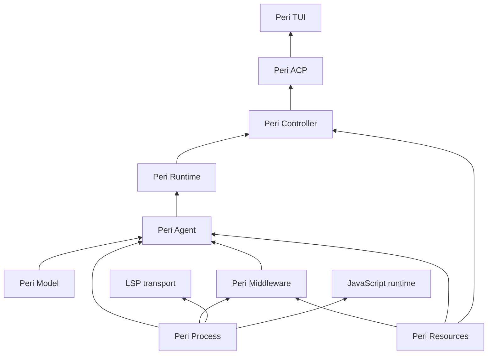
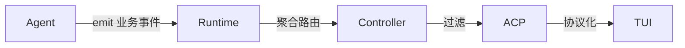
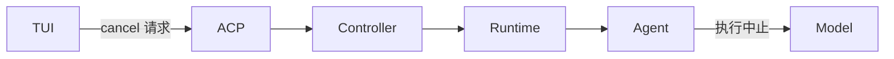
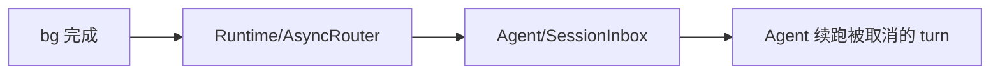

# Perihelion 总体架构

> 状态：现行设计
>
> 本文说明各层职责、允许的依赖方向与跨层数据流。跨模块强制不变量以
> `docs/standards/architecture-contracts.md` 为准；代码入口以
> `docs/code-index/` 为准。

## 0. 依赖规则

禁止跨层调用，依赖只能沿声明边单向。箭头 = 提供方向：

- 边含义：Model 提供协议能力；Agent 提供 session 运行单元；Runtime 提供多 session 编排；Controller 提供业务操作；ACP 提供协议服务；Middleware 提供 Hook 实现；Resources 提供外部数据抓手
- 未声明边一律禁止
- crate 依赖方向进 CI 验证

`peri-process` 是不依赖业务层的 OS 子进程能力：在 spawn 前配置独立进程组或
Windows 挂起进程，attach 后提供终止请求与实际退出证据。它不拥有 session、
数据库 lease、协议或 UI；Bash、MCP、LSP 和 JavaScript 的各自 owner 持有它并
负责等待清理。进程树实现不得因复用而让 LSP 反向依赖 Agent。

归层判据（三问定层）：

- 生命周期：状态跟着 session 活的归 Agent；跟着进程/多 session 活的归 Runtime；单次调用即结束的不跨层
- 来源：LLM 协议形态归 Model；ACP 协议形态归 ACP；外部系统数据，访问通道归 Resources，持有按生命周期
- 消费：界面呈现归 TUI；组合多源决策归 Controller；旁路观测走独立通道，不参与业务链路
- 优先级：通道与持有分离，通道归 Resources，持有按生命周期
- 优先级：生命周期优先于消费，消费层只拿引用
- 兜底：协议适配归 Model；业务切面归 Middleware；界面归 TUI；接口契约归 peri-acp-types
- 争议按上述顺序裁定，不另行讨论

## 1. Peri Model 层

- 协议适配：openai + anthropic 双协议 adapter
- 协议消息统一抽象：ModelMessage/ModelStream（仅协议形态，不含业务语义）
- 流式抽象：统一流式输出接口（ModelStreamEvent）
- 最底层，无依赖

## 2. Peri Agent 层

- session 生命周期容器：Session 创建/运行/销毁全生命周期归此层
  - 聚合根原则：归此层的职责以 session 生命周期为界；session 是聚合根，本节职责范围由此自洽
  - AgentGroup（agm 理念：Agent 平等、管线通讯）
  - frozen data 构建与持有：session 创建时从 Resources 拉磁盘数据（CLAUDE.md/skills/日期）冻结；subagent 创建时 copy
  - Session 级 hook（on_session_start/end）随 session 归此层
- subagent 创建：SessionFactory::spawn_subagent(parent, config)
  - 建 thread：经 Resources 存储，parent_thread_id 挂父子链
  - 建 session：transcript 绑定存储（with_persistence）
  - 运行 + 结束：更新 agent_status
- async tasks manager：异步 shell 实际执行、bg agent、cron、channel 触发
  - BackgroundTaskRegistry 归此层统一管理：per-session 实例化，随 session 创建/销毁（生命周期/取消/事件跟随 session）
  - Middleware 只做定义与启动发起，不持有管理权
  - 任务启动执行（进程 spawn/进程组/超时/输出收集）在此层
- 消息统一：MessageType（Human/Ai/Tool/SystemReminder，v2 BaseMessage 更名；协议转换在 Reason 阶段）
- MQ 消息管理：MessageQueue（Prompt/Defer/Info + MessageSource）
- RCRA 循环：Receive -> Compact -> Reason -> Act，Receive 为唯一退出口
- Hook/Middleware 统一抽象：MiddlewareHook trait
- Middleware 链装配：session 初始化时构建（数据自 Resources；事实源自 peri-acp builder 迁入，ARC-MIDDLEWARE-001 同步迁）
- cancel 最终执行权：Cascade/Independent 判定与终止执行归此层，上层仅传递，Model 执行中止

## 3. Peri Runtime 层

- 多 session 编排器：创建/销毁 session（经 Agent 层工厂）、事件聚合路由、调度
- 无状态：唯一持有 `session_id -> SessionHandle` 映射
  - 不持有 session 状态、无持久态、无业务配置
  - 其余全部注入，状态在 Agent 层各 session 内

## 4. Peri Middleware 分片

- 实现 MiddlewareHook，聚合业务模块：FS/Goal/SubAgent/HITL/...
- MCP：薄封装 Resources 层 MCP 管理为 middleware（工具注册/执行桥接），连接状态从 Resources context 获取
- bg：任务定义 + 启动发起（调 Agent 层 TaskManager 接口），不持有管理权
- 外部依赖一律经 Resources context，不直接触碰外部系统
- 切面 = hook 挂载 + 工具声明 + prompt 贡献 + 条件守卫

## 5. Peri Resources 层

- 外部系统门面：抽象外部数据，对上提供抓手
  - peri-config：直操配置文件（settings.json 等）
  - peri-sessions：直操 sqlite（session 持久化、transcript；SqliteThreadStore 实现迁入）
  - MCP 状态维持、HITL broker、secret
- 不解释业务语义：只保存与适配状态（存储/配置/连接）；重实现仅限协议适配且显式声明
- 以 context 形式提供给 Agent / Middleware / Controller

## 6. Peri Controller 层

- 控制面：lite params -> pick Resources -> pick Runtime -> run Session -> pop events
  - lite params 定义：session 标识、agent 定义引用、cwd、初始输入
  - 其余上下文由 Controller 从 Resources 组装注入
- 事件聚合/过滤（业务事件 -> 协议化前的出口）
- cancel：`Controller::cancel(session_id, policy)` -> Runtime 查映射 -> Agent 执行判定 -> Model 中止
  - 只定位与转发，不解释取消语义
- 观测：横切面旁路，非业务职责
  - 采集点分散各层：Model 层 token/调用、Agent 层 stage/turn、Controller 操作、ACP 事件
  - 汇聚：观测事件随主事件流走，在协议化前分支给 Langfuse bridge
  - bridge 是事件流旁路消费者（装配在 Controller 侧宿主），不承担 Controller 职责
  - 关联靠身份牌（session_id + turn_id + agent_id），不改变业务链路

## 7. Peri ACP 层

- 纯协议实现：ACP 协议适配，不承载业务
- 事件协议化映射、caps 门控
- 全部客户端（TUI/CLI/stdio/IDE/print）一律经 ACP
- 部署单元：TUI/print = `peri-tui` 客户端装配；stdio/IDE = `run_acp_stdio(StdioInput)`（`peri-acp/src/host/stdio/mod.rs`）→ `assemble_stdio_config` → `run_acp_server`——与 TUI 共用同一 `run_acp_server`（`handle_request` + `dispatch_prompt_turn`），仅 transport 多态（mpsc vs `transport/stdio.rs` `StdioTransport`，JSON-RPC 2.0 newline-delimited）

## 8. Peri TUI 层（View 层）

- 职责：把 ACP 传来的数据映射成界面呈现（渲染）
- cli = 启动接口：装配 View 与 ACP 客户端，不承载业务
- print = 同层轻量渲染客户端（无界面，输出文本）
- 只经 ACP 拿数据，不触碰业务层
- 部署装配输入：cli 全局参数 `--config-file` / `--db-path`（别名 camelCase）进程级重定向全局配置文件与 SQLite 会话数据库路径，TUI / print / `peri acp` 三路径生效；thread store 实例化在装配面（`Resources::open_with` / agent 侧 `open_thread_store_with`），ACP 协议面不感知。已知边界：`peri sync` 与 middlewares 侧 skillsDir/MCP 全局配置仍读写默认 `~/.peri/settings.json`（不跟随重定向）

## 9. 横切面

事件链路：

cancel 链路：

事件契约：

- 事件携带 turn_id + agent_id；session_id 由 Runtime 聚合时按 session 维度补打（Agent 层事件不携带）
- 同 session 事件带单调序号（session_seq）
- terminal 事件必须位于该 turn 全部输出事件之后

身份标识：

- 跨层消息统一携带 (session_id, session_epoch, turn_id, attempt_id)
- epoch/attempt_id 不可复用（防迟到消息命中新 session）

cancel 契约：

- Agent 持有最终执行权，上层仅传递，Model 执行中止
- 幂等：针对 (session_id, turn_id, attempt_id)；重复 cancel 结果一致；turn 终态唯一（Completed 或 Interrupted）
- 优先级：cancel > 续跑 > promote > retry；cancel 后已排队的 resume/promote 全部失效
- cancel ≠ 清除待办：MQ 未消费消息保留，随下次循环消费（作为新 attempt 输入）
  - cancel 请求可带 clear_queue 标志（默认 false）

session 销毁顺序：

- 停收新输入 -> 取消 owned tasks -> join（带 deadline）-> 超时 abort -> 持久化事务收束 -> drain 事件 -> 移除映射

持久真相：

- Thread/transcript = 持久真相；Task = 易失投影
- 重启不复活 Task；遗留 Running/Creating 记录标记为中断

续跑链路（cancel 的镜像）：

错误模型：边界类型化，层内 anyhow

- 跨层边界用 thiserror 枚举，逐层包 context；层内 anyhow 穿透
- 仅三类必须类型化：终止类（cancel/interrupt，防 `?` 误报失败）、可重试类（rate limit/超时，重试策略用）、协议错误（ACP 序列化用）
- TurnError 语义保留 Agent 层（TUI 展示/重试依赖）
- 其余细节错误不逐层映射

compact：RCRA 阶段归 Agent，token 计数经 Model

HITL/secret：broker 经 Resources 注入 Middleware（OnPermissionRequest 在 Middleware）

Task vs Thread：

- Task：内存运行态（registry），bg shell/后台 SubAgent，不持久化，生命周期跟随 session
- Thread：持久化实体（sqlite），ThreadMeta + 消息，subagent 必有
- 父子链 parent_thread_id = 父子标记的持久化载体（thread_id = agent_id）
