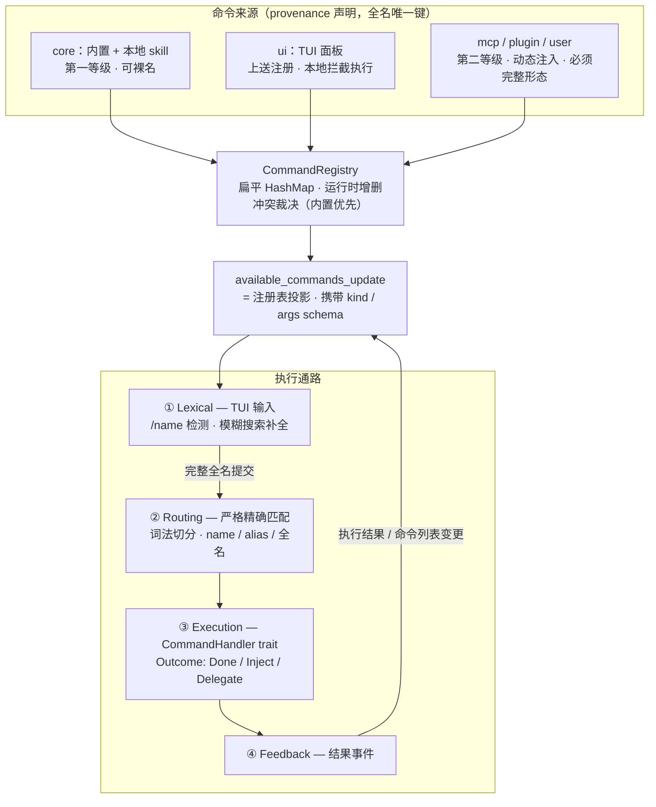
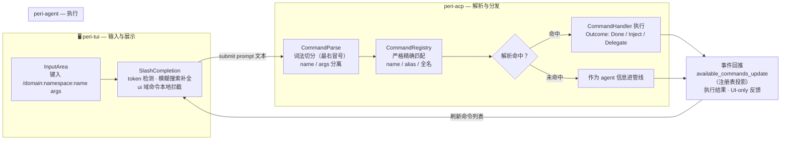
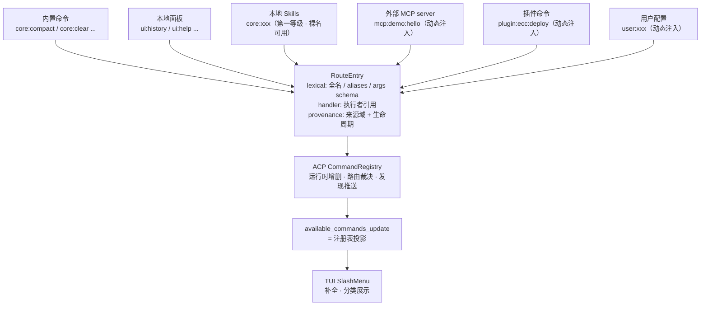

# Command 系统权威架构

> 状态：已批准目标设计；当前代码差距与实施进度由对应 active issue 维护。
>
> 事实源：`peri-acp-types/src/command.rs`（契约，子模块挂载点）+ `command_name.rs`（词法契约）+ `command_registry.rs`（注册表本体）、`peri-acp/src/session/command/mod.rs`（组合根 / register_builtins）、`peri-agent/src/session/exec/executor.rs`（拦截）、`peri-tui/src/kit/input_area.rs` + `slash_completion.rs`（展示）。

## 本质定义

命令 = 用户以 `/` 前缀显式声明的**确定性路由请求**。与自然语言 prompt 的区别在于路由权归属：slash 命令的路由目标由用户显式声明，在 agent 的模糊解释之前被确定性拦截。

**command 系统是机制，不是内容**：它提供词法解析、路由表、路由裁决、冲突规则、发现推送；不拥有任何具体命令。命令由所属层（TUI / ACP / Agent / 插件 / 用户 / 外部系统）声明并注册，内置命令只是"预注册的路由表条目"。

## 架构全貌



## 权威词法：统一字符串结构

所有来源（内置 / 面板 / MCP skill / skill tool / 插件 / 用户自定义）统一为一种结构，`mcp__` 双下划线形态废弃：

```
CommandName := 裸名                              // 第一等级域（core / ui）隐式
             | domain ":" name                   // 1 层冒号：第一等级显式形态
             | domain ":" namespace ":" name     // 2 层冒号：第二等级完整形态
```

- **层数上限：2 段冒号（3 段词）**，最右冒号切分（`rsplit_once(':')`，与 `mcp_skills.rs` / `skill_preload.rs` 先例一致）。
- **第一等级**（可裸名 / 1 层显式）：`core`（内置命令 + 本地 skill）、`ui`（TUI 面板）。本地 skill 归第一层级——`/skill-name` 短输入体验保留，与内置命令同域同权。
- **第二等级**（外部来源，必须完整 2 层形态）：`mcp` / `plugin` / `user`。namespace 显式标记不可省略——`mcp:demo:hello`（demo=server 名）、`plugin:ecc:deploy`（ecc=插件名）；`mcp:hello` 形态对外部来源非法。
- **输入严格，不宽松**：执行解析仅精确匹配（name / alias / 完整全名）；无域省略简写（`demo:hello` 废弃）、无唯一前缀自动补全（`/rew` 不解析为 `/rewind`）、无唯一后缀 fallback。**模糊只发生在搜索层**：UI 补全（SlashCompletion fuzzy 过滤）负责提示与补全，用户选中后以完整形式提交。
- **语义对应**：domain = 来源域（provenance 首段），namespace = 来源域内标识（server / 插件名），name = 命令名。词法结构直接携带路由信息。
- **唯一键 = 全名小写**：重名在词法层消除，"本地优先按名去重"退化为键唯一性检查。
- **namespace 首段由 provenance 声明，不可伪造**：插件只能注册 `plugin:*`，MCP server 只能注册 `mcp:*`。
- **`mcp__` 双下划线形态直接废弃**：不属任何合法词法形态，解析即失败；补全列表只展示新形态。

## Routing 层（注册表）

- **数据结构：扁平 map，不做树**。`HashMap<fullname_lowercase, RouteEntry>` + `HashMap<alias_lowercase, fullname>`；严格输入下查找永远精确（全名 / 第一等级域内裸名 / alias），域枚举用前缀过滤（`mcp:demo:`）。
- **冲突裁决在注册路径**：优先级 内置 > 本地 skill > 动态注入（MCP / 插件 / 用户）；低优先级重名 → 拒绝 + 警告，不覆盖、不静默。
- **生命周期**：发现完成才注册（`Started → Discovered` 不占位）；断连按 namespace 前缀批量注销；变更触发 `on_change` → 投影重建推送（`McpSkillRegistry` 先例泛化）；重连 = 注销 → 重发现 → 重注册，天然无 ABA。
- **投影协议**：`available_commands_update` = 注册表投影，每条携带 kind / category / args schema 渲染元数据；TUI `build_slash_items` 的反推逻辑整体删除。
- **ui 域归属：TUI 上送注册**。TUI 是 ui 命令拥有者，连接时把自己的 ui 命令注册进 ACP 注册表（provenance=ui，handler=TUI-local，经 `caps.ui_commands` 通道升级为能力明细）；执行时 TUI 提交前检查 `ui:` 域 → 本地拦截，不发 ACP。

## Execution 层（handler / args / context）

- **handler：trait object 为主，执行域是元数据而非类型**。`trait CommandHandler { fn execute(&self, ctx) -> CommandOutcome }`；`CommandOutcome = Done(CommandResult) | Inject(String) | Delegate(String)`（Done=完成并反馈，Inject=透传指令进 agent 管线，Delegate=转发其他执行者：ui 域回 TUI / 未来 MCP 直连）。`AgentPassthrough` / `McpProxy` 是数据驱动的 handler 实现，不是路由层的分支。新增执行域 = 新增 trait 实现，注册表 / 协议 / 路由核心零改动。
- **注册表与执行解耦（类型层面）**：注册表只持 `Arc<dyn CommandHandler>` + 元数据，不 import 任何 handler 实现；新增命令 = 新模块在组合根注册。
- **args schema：serde 完整模型，投影协议成员**。`ArgsSchema { positionals, named, flags }`，`ArgKind = String | Int | Choice(Vec<String>) | Path`，模型第一版即完整（TUI 补全 / 校验器依赖其形状，残缺模型是破坏性变更）；解析器分阶段实现，第一版 Positional / Named / Flag + Choice 校验，Path 校验存在性、补全留待 TUI 能力。
- **CommandContext：接口注册表**。core 常驻（session_id / history / cwd / event_sink / cancel_token）；扩展依赖经 `ctx.dep::<dyn Trait>()` 按接口取（非具体类型，可注入 mock），DependencyBag 内部 `HashMap<TypeId, Arc<dyn Any + Send + Sync>>`；新增依赖不动 Context 结构体；缺失 → 优雅报错。

## Feedback 层（反馈通道）

- **未解析一律 fall through，不报错**：`/xxx` 解析未命中 → 作为 agent 信息进入管线（Linux 下 `/` 与绝对路径冲突，`/etc/hosts` 常见；确定性路由的边界 = 已解析的命令必须确定性执行，未解析的 slash 文本不判定为错误）。**词法非法同样 fall through**（`/a:b` 未知域、`/mcp:hello` 缺 namespace 一律进管线，不报错——裁决 2026-08-15，P2-3 定案）；`register` 路径仍严格校验（词法/域校验拒绝注册），仅 `resolve` 路径宽松。例外：execute-command RPC 是显式命令请求（无 agent 管线可注入），resolve 失败 → 显式错误。
- **反馈双通道，默认 UI-only，不污染会话**：`CommandFeedback { level, message, channel: UiOnly（默认）| Session（opt-in）}`。UiOnly → 通知条/状态区渲染，不进会话，agent 永不见（clear/compact/rewind 反馈全部如此）；Session 仅命令显式 opt-in。会话是 agent 的上下文，运维反馈不是 agent 该看的。
- **Inject 反馈**："已应用 skill X"提示为 UI-only；agent 见到的只有注入的指令文本本身（指令是语义，不是反馈）。
- **错误不进会话**：词法非法 / 路由未命中 / 执行失败，全部走 UI 通道（确定性错误事件 + 通知条），零会话污染；历史回看依赖 TUI 事件日志。

## 协议层（投影 / 上送 / 回传）

- **投影条目升级**：`AvailableCommand = { fullname（唯一键，注册表层）, kind（Command | Skill | McpSkill | Panel，注册时由 handler 域推导一次）, description, aliases, category?, args?（serde ArgsSchema）, level（1 | 2） }`；wire `name` 字段承载投影渲染形态（见「渲染形态」，Level1 裸名 / Level2 全名），域归属经条目级 `periKind` / `periLevel` 下发。
- **键模型**：唯一键 = 全名（`core:compact` / `ui:history` / `mcp:demo:hello`）；**裸名不是独立键**，是解析层对第一等级域（core / ui）的快捷匹配——`/compact` 在 core/ui 域内精确匹配 name。本地 skill 与内置命令同键（`core:compact`），冲突裁决在注册路径生效，模型自洽。
- **渲染形态（协议层投影即渲染形态，TUI/stdio 一条实现）**：投影 name 按 level 渲染——level 1 输出裸名（`compact`），level 2 输出全名（`mcp:demo:hello`）；**display 即 lexical**，用户提交的文本与显示一致，解析器严格命中。注册表唯一键仍为全名；投影 name 允许 core/ui 同裸名重复（`core:hello` 与 `ui:hello` 均投影为 `hello`），消费端按条目级 kind 区分，投影不做按名去重。
- **caps 升级**：`ui_commands: bool → Vec<UiCommandSpec{ name, aliases, description, args? }>`。TUI 连接时上送明细 → ACP 注册为 `ui:*` 条目（provenance=ui，handler=TuiLocal）；ACP 的 `UI_COMMANDS` 常量整体删除，门控语义反转——从"TUI 声明 bool → ACP 附加硬编码"变为"TUI 声明明细 → ACP 注册"。
- **执行结果回传**：`CommandResult` 增 `feedback: Option<CommandFeedback{ level, message, channel }>`；新增 `CommandFeedback` 事件（ACP → TUI 通知条渲染）；channel=Session 仅 opt-in 才另写系统消息进会话；执行失败 = `level: Error` 走同一事件通道。
- **动态注册 / 注销**：MCP / 插件发现走 ACP 内部（middleware → 注册表），不经 TUI 协议；变更统一经 `available_commands_update` 投影推送（触发时机 = 注册表 on_change）。

## 图 1：命令生命周期（运行时链路）



## 图 2：命令定义单一事实源（来源收敛）



## 正交维度：执行域 × 声明来源

命令有两个独立属性，不可混为一谈：

- **执行域（在哪执行）**：TUI 本地动作 / ACP 进程内函数 / Agent 管线指令 / 外部进程（MCP tool 调用 / 插件 IPC）。
- **声明来源 provenance（谁声明、何时存在）**：静态内置 / 动态注入（外部 MCP server、插件、用户配置）。

MCP skill 的组合即：声明来源 = 外部系统（动态），执行域 = Agent 管线 + 外部 MCP tool。外部系统命令不改变执行通路，但要求路由表支持**运行时注册 / 注销**，且条目携带 provenance（来源 + 生命周期状态：已连接 / 发现中 / 已发现 / 断连清理）。

**注入链路（权威形态）**：外部系统连接 → 发现任务 → 注册表动态写入 RouteEntry → 推送投影 → 断连 → 注册表注销 → 投影自动收缩。展示列表与执行路由是**同一份数据的投影**，不漂移。

## 设计不变式

1. **单一事实源**：命令元数据只在 RouteEntry 定义一次；`build_slash_items` 不得再用 SKILL_NAMES / MCP_SKILL_NAMES 集合反推 kind（现状：`peri-tui/src/kit/input_area.rs` 的 `build_slash_items` 在反推）。
2. **展示与执行解耦**：TUI 不执行命令语义判断，只消费 `available_commands_update` 投影。
3. **解析唯一实现**：词法切分、严格精确匹配、alias 解析只在注册表一处实现（现状 `find` / `find_arc` 双份复制）。
4. **handler 开放扩展**：执行域是元数据不是类型；`CommandHandler` trait + `Outcome{Done, Inject, Delegate}`；新增执行域 = 新增 trait 实现，路由核心零改动。
5. **上下文按需注入**：core 字段常驻，扩展依赖经 `ctx.dep::<dyn Trait>()` 接口注册表按需获取；新增依赖不动 `CommandContext` 结构体；缺注入的命令优雅报错。
