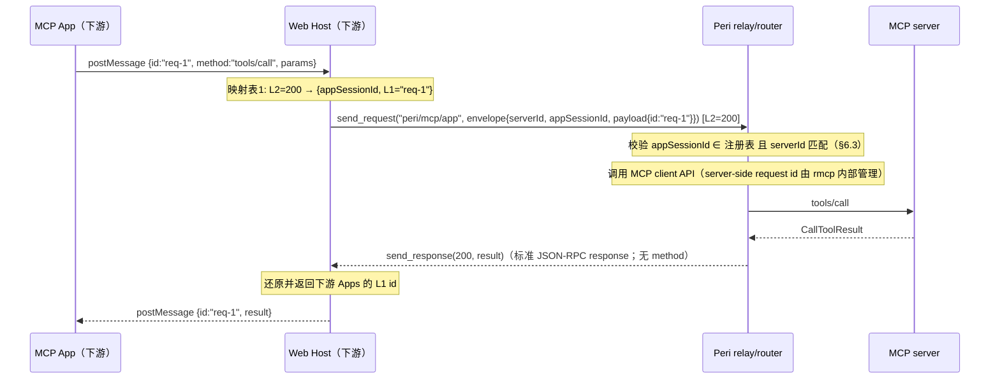
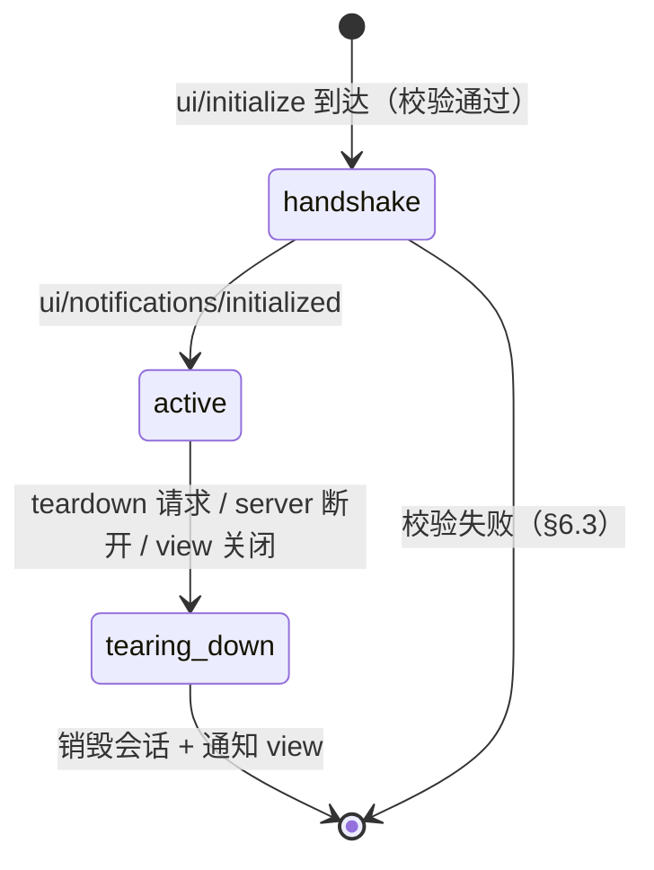
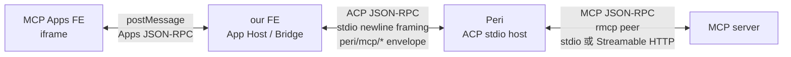
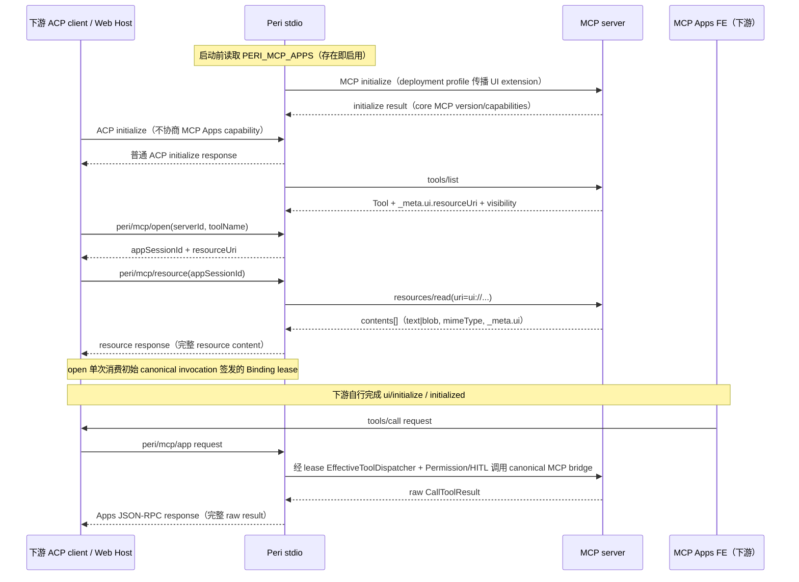

# MCP 透传信道设计（单 ACP 连接上的多路数据分离）· 定稿

> 本文件是「外部 MCP server ↔ view 层」透传信道的设计定稿，回答一个问题：**ACP 只有一条连接，多个 MCP server 的数据（App 交互、工具结果、通知）如何在这条信道上分离路由，保证数据正确送达正确的接收方。**
>
> 状态：**现行设计**——stdio relay 由 `PERI_MCP_APPS` deployment profile 启用；Apps envelope、binding lease、resource relay 与 canonical Permission/HITL 工具调用已落地。下游 Web Host、iframe 与 TUI Apps 渲染不在 Peri relay 范围内。
> 关联文档：`docs/reference/mcp-ecosystem.md`（MCP 生态定位，§6 MCP Apps、§9 内部落地）；`docs/design/peri-acp-protocol.md`（ACP 协议）
> 本文是 Perihelion 内部 relay 的目标设计，不复制或替代外部 MCP/MCP Apps 规范。

## 目录

- [1. 目标与范围](#1-目标与范围)
- [2. 信道现状（代码事实）](#2-信道现状代码事实)
- [3. 设计决策总览](#3-设计决策总览)
- [4. 信封与消息类型](#4-信封与消息类型)
- [5. id 映射：数据正确性的核心](#5-id-映射数据正确性的核心)
- [6. App 会话生命周期与鉴权](#6-app-会话生命周期与鉴权)
- [7. 分流规则（防双写）](#7-分流规则防双写)
- [8. 错误语义](#8-错误语义)
- [9. 可靠性：超时 / 背压 / 协议版本](#9-可靠性超时--背压--协议版本)

## 1. 目标与范围

### 1.1 要解决的问题

- ACP 连接只有一条（下游 UI ↔ ACP Server 为 `StdioTransport`），传输层是纯 JSON-RPC 2.0（Request / Notification / Response）。`peri-tui` 不属于本设计范围。
- 需要在 stdio ACP 信道上承载多个 MCP server 的 Apps 数据：`PERI_MCP_APPS` 在进程启动时存在则启用 deployment capability，并向 MCP server 传播 UI extension。
- 目标：**任意时刻、任意并发 App 之间的数据互不串扰**——一个下游 UI session 发起的 `tools/call` 的结果只回到该 session，且只能调用它所属 server 的工具。

### 1.2 范围

- **在**：环境 deployment capability、MCP server capability 传播、透传帧、id 映射、会话绑定、错误语义与可靠性。
- **不在**：MCP Apps 协议本身（`ui/initialize` 等代表性方法，见 guide §6.3）；Web Host/iframe 渲染、sandbox、CSP、Permissions Policy、`postMessage` bridge 及 MCP Apps FE 内部实现；HITL 权限机制（共用现有执行路径，不重新设计）。

### 1.3 设计原则（沿用 guide §6.2/§9.2 既有结论）

1. **payload 保留 MCP Apps 原始消息**：下游 Web Host 可将 payload 交给其自己的 Apps bridge；Peri 不解析或实现 `postMessage`，但必须解析外层 envelope 并执行 server/session 路由校验。
2. **透传不绕过安全模型**：App 发起的 `tools/call` 与 agent 发起的工具调用共用同一执行路径与 HITL 权限。
3. **能力由 deployment 环境驱动**：`PERI_MCP_APPS` 只看是否存在；存在时整个进程的初始 MCP 连接和重连声明 UI capability，不存在时完全关闭。
4. **下游 Web Host 不属于 Peri**：iframe、sandbox、CSP、Permissions Policy、`postMessage`、App FE 生命周期由下游实现；Peri 只提供 ACP 数据与协议 contract。
5. **view 不接触 MCP connection**：下游只通过 ACP 获取 Peri 投影的数据，不持有 Peri 的 MCP peer、stdio handle 或 server credentials。

## 2. 信道现状（代码事实）

设计必须基于以下已验证事实，避免「设计落不了地」：

| 事实 | 位置 | 含义 |
| --- | --- | --- |
| `AcpTransport` 是**双向**的：`send_request` / `send_notification` / `recv` / `send_response` | `peri-acp/src/transport/mod.rs` | 传输层已具备 view → agent 的 request/response 能力，无需新传输 |
| `RequestRouter`：全局递增 i64 id + pending map（oneshot 匹配 Response） | `peri-acp/src/transport/router.rs` | 传输层 id 空间是**单一共享**的；String id 不参与匹配（落 unmatched 转发路径） |
| 事件链是 agent → view **单向 notification**（`session/update`、`peri/agent_event*`、`peri/unstable-event`） | `peri-acp/src/session/event_sink.rs` | 事件链不能承载「需要响应的请求」；透传请求必须走 `send_request`/`send_response` |
| `McpClientPool` 以 `server_name`（String）为 key | `peri-middlewares/src/mcp/client.rs` | `server_name` 是 MCP 侧唯一路由键 |
| 订阅通知（server → agent）默认**进 agent inbox、不进 view** | guide §9.1，`McpSubscriptionPort` | 已避开通知风暴；本文不改变该决策 |
| 工具名 `mcp__<server>__<tool>` 携带 server 前缀 | guide §3.4 | view 可从工具名解析 `serverId`，事件链无需新增字段即可关联 server |
| 现有 ACP 方法名空间：`session/*`、`plugin/*`、`peri/agent_event*`、`mcp/oauth_*`、`marketplace/*`、`elicitation/create` | guide §9.2 | 新方法名必须避开全部既有前缀 |
| 代码中**不存在** `serverId` / `appSessionId` 字段 | 全仓 grep | 透传信封与会话注册表是全新代码，无既有约定可破坏 |

## 3. 设计决策总览

| # | 决策点 | 选择 | 理由 |
| --- | --- | --- | --- |
| D1 | 外层方法名 | **包装**：`peri/mcp/app`、`peri/mcp/resource`（否决定稿前 guide §9.2 的「倾向裸传」） | 见 3.1 |
| D2 | 信封字段 | `envelopeVersion` + `serverId` + `appSessionId` + `resourceUri` + `mcpProtocolVersion`（可选）+ `appsProtocolVersion`（由 payload/下游协商）+ `payload` | 见第 4 章 |
| D3 | id 空间 | ACP 外层 transport id 与 payload 内 Apps id 分离；MCP server id 由 MCP client 管理，不假设 Peri 可见 | 见第 5 章 |
| D4 | 请求-响应关联 | ACP request 用 transport id；payload 保留 Apps request id；Peri 不复制 MCP client 的内部 pending map | 见 5.2 |
| D5 | App 会话 | connection-owned 注册表 `appSessionId → {connectionId, serverId, resourceUri, bindings, state}` | 见第 6 章 |
| D6 | 防双写 | agent 发起的调用走下游结果通知；App 发起的调用只走对应 JSON-RPC response | 见第 7 章 |
| D7 | 错误分界 | envelope/routing error 与 payload 内 JSON-RPC error 分层表达，不根据 `-320xx` 范围猜测来源 | 见第 8 章 |
| D8 | 背压 | App 事件天然低频 + 同类通知 coalesce；具体队列策略待实现时验证 | 见 9.2 |
| D9 | 协议版本 | 分离 ACP、envelope、MCP core、MCP Apps 四类版本；不以 server core version 替代 Apps version | 见 9.3 |

### 3.1 D1：为什么包装，而不是裸传（对 §9.2 的修订）

guide §9.2 原方案倾向外层直接使用 Apps 方法名。定稿改为**包装一层**，理由基于代码事实：

1. **方法名空间平铺共享**：`session/*`、`plugin/*`、`marketplace/*`、`mcp/oauth_*` 都在同一信道。裸传 `tools/call`、`ui/initialize` 与 ACP 原生方法名无结构性区分——view 侧桥 JS 必须维护一份「MCP 方法名白名单」才能分辨「剥信封」与「正常处理」，而白名单会随 MCP 规范演进失效。
2. **`mcp/` 前缀已被占用**：`mcp/oauth_*` 占用了 `mcp/` 前缀（guide §6.2 已知冲突点）。裸传方案必须与 `mcp/oauth_*` 共存或改名，包装用 `peri/mcp/` 天然避让。
3. **参照系一致**：grok-build 选择 `x.ai/mcp/*` 包装（guide §9.2 记录），非裸传。
4. **成本为零**：包装只是信封——`payload` 仍是 MCP 原始消息（原则 1 不破），view 剥信封即得原文。

**取舍代价**：view 侧桥 JS 多一次信封编解码（约 10 行），换来方法名空间的确定性隔离。值。

## 4. 信封与消息类型

### 4.1 信封结构（双向通用）

```jsonc
{
  "method": "peri/mcp/app",
  "id": 100,
  "params": {
    "envelopeVersion": "1",
    "serverId": "github",
    "appSessionId": "app_01H4X...",
    "resourceUri": "ui://get-time/mcp-app.html",
    "mcpProtocolVersion": "2026-07-28",
    "appsProtocolVersion": "2026-01-26",
    "payload": {
      "jsonrpc": "2.0",
      "id": "req-1",
      "method": "tools/call",
      "params": { "name": "list_issues", "arguments": {} }
    }
  }
}
```

约束：`payload` 保留下游 Apps JSON-RPC 语义，但不会字节级转发到 MCP server；Peri 将其映射到 MCP client API。`mcpProtocolVersion` 表示 Peri 与 server 的 core MCP 协商结果；`appsProtocolVersion` 表示下游 Apps payload 使用的版本，两者不可互换。
资源读取（view 拉 `ui://` HTML 渲染）不依赖 App 会话，单独方法：

```jsonc
{
  "method": "peri/mcp/resource",
  "id": 101,
  "params": {
    "serverId": "github",
    "uri": "ui://get-time/mcp-app.html"
  }
}
```

### 4.2 消息类型矩阵

| 方向 | 类型 | 方法 | 对应 MCP Apps 语义 |
| --- | --- | --- | --- |
| view → agent | request | `peri/mcp/app` | App 的 `ui/initialize`、`tools/call` 等请求 |
| view → agent | notification | `peri/mcp/app` | App 的 `ui/notifications/*`（size-changed 等） |
| view → agent | request | `peri/mcp/resource` | view 拉取 `ui://` HTML |
| agent → view | response | —（以传输层 id 关联） | 上述 request 的响应；`payload.id` 为 App 原始 id |
| agent → view | notification | `peri/mcp/app` | Host → App 推送：`ui/notifications/host-context-changed`、`teardown` 等 |

**方向识别**：JSON-RPC 连接上同一方法名双向可用，接收方按「自己是谁」解析 `payload.method`（view 收到 `peri/mcp/app` 一定是 Host → App 推送；agent 收到一定是 App → Host 消息），无需额外方向字段。

### 4.3 约束

- `peri/mcp/*` 前缀**保留**：未来新增透传能力（如 `resources/read` 回调）只在 `peri/mcp/` 下加方法名，不与既有命名空间冲突。
- envelope 未知字段忽略（JSON-RPC 宽容原则），但 `serverId` / `payload` 必填，缺失按 §8 错误处理。

## 5. id 映射：数据正确性的核心

### 5.1 两层可见 request id

| 层 | id 由谁分配 | 形态 | 用途 |
| --- | --- | --- | --- |
| L1 | 下游 Apps payload | string 或 number | 下游 Apps request/response 关联 |
| L2 | ACP `RequestRouter` | 全局递增 i64 | ACP 单信道 request/response 关联 |

MCP server 侧 request id 由 `rmcp`/MCP client 内部管理，不属于 ACP payload，也不由 Peri 复制维护。

**不变量**：Apps payload 中的 `id` 保持 L1；ACP 外层使用 L2；Peri 将 L1 request 映射为 MCP client API 调用，并用 L2 response 恢复对应的 Apps response。Apps notification 不产生 response；Host → App 的 request 也必须在下游完成自己的 response 关联。

### 5.2 一次 `tools/call` 的完整旅程



### 5.3 映射表规则

- **下游侧**：负责 L2 与其 Apps L1 id 的关联；这是 Web Host 的实现细节，不属于 Peri。
- **Peri 侧**：ACP host 已以 L2 关联入站 request；调用 MCP client async API 后，用同一个 L2 返回结果。除非实现证据表明 rmcp 无法关联请求，否则不建立第二份 server request-id pending map。
- 多个 App 即使复用相同 L1 id，也因 `connectionOwner + appSessionId + L2` 隔离而不冲突。

### 5.4 并发正确性

- 多个 App 或 ACP connections 并发时，L2 由 ACP transport 唯一关联；L1 仅在各自下游 Apps session 内有意义。
- 同一 App 内并发多个 request 时，下游和 ACP transport 分别维护各自 pending state。
- `payload.id` 支持 string 或 number；notification 无 id 且不能生成 response。

## 6. App 会话生命周期与鉴权

### 6.1 会话注册表（按 ACP connection 所有权隔离）

```rust
struct AppSession {
    app_session_id: String,
    connection_owner: String,
    server_id: String,
    server_generation: u64,
    resource_uri: String,
    allowed_tools: Vec<String>,
    apps_protocol_version: Option<String>,
    state: AppSessionState,
    created_at: Instant,
}
```

- 每个 session 必须绑定 ACP connection owner；connection EOF 只清理该 owner 的 session。
- `server_generation` 防止 MCP server 重连后旧 App session 调用新 peer。
- `resource_uri` 与 tool binding 来自 `Tool._meta.ui.resourceUri`，不能从 App 自报的 `appInfo.name` 推导，也不能依赖 resource 必须出现在 `resources/list`。
- session registry 可以由进程级 owner 持有，但 key/值必须包含 connection ownership，不能成为跨连接共享授权状态。

### 6.2 状态机



### 6.3 鉴权校验（防跨 server 冒充的关键）

agent 侧收到 `peri/mcp/app` 时按序校验，任一失败按 §8 返回：

1. **会话存在且 owner 一致**：`appSessionId` 属于当前 ACP connection；不能访问其他 connection 的 session。
2. **归属一致**：信封 `serverId`、绑定 `resourceUri` 与 session 一致。
3. **server generation 一致**：MCP server 重连后旧 session 必须失效。
4. **状态合法**：业务 request 仅在 active 状态允许；notification 不产生 response。
5. **tool 可调用**：tool 属于绑定 server，且 `_meta.ui.visibility` 包含 `"app"`；未声明 visibility 时按规范默认值处理。
6. **capability 已启用**：当前 ACP connection 声明 Apps/UI capability，且对应 MCP connection profile 已向 server 传播并完成协商。
7. **权限路径有效**：App 工具调用进入 canonical invocation/HITL seam；不得直接调用低层 MCP peer 绕过审批。

`ui/initialize` 属于下游 Web Host ↔ App 的协议握手，Peri 不以 `appInfo.name` 推导授权。Peri session 应由下游针对已发现的 `{serverId, resourceUri, tool binding}` 显式创建/绑定，并将随后 payload 限制在该绑定内。

### 6.4 teardown 触发

| 触发源 | agent 侧动作 | view 侧动作 |
| --- | --- | --- |
| 下游主动关闭 App session | 清理该 connection-owned session 和 pending requests | 下游自行 teardown Web Host/App |
| server 断开或 generation 变化 | 失效该 server 旧 generation 的全部 session；通过 ACP 通知下游 | 下游决定 UI 处置 |
| ACP connection 关闭 | 只清理该 connection owner 的 session | — |

`ui/resource-teardown` 是下游 Web Host → App 的 request/response，不由 Peri 生成或执行；若下游选择经 ACP 传递相关 lifecycle payload，Peri 仅做 session 定向与至多一次 terminal delivery。

## 7. 分流规则（防双写）

| 数据 | 通道 | 依据 |
| --- | --- | --- |
| agent 发起的工具调用结果（带 `ui.resourceUri`） | 事件链（现状，不变） | guide §9.4；view 从工具名 `mcp__<server>__<tool>` 解析 serverId |
| App 发起的 `tools/call` 结果 | 透传 response（**不进事件链**） | 双写会致 view 收两份结果 |
| `ui://` HTML 内容 | `peri/mcp/resource` 响应（**不进事件链**） | 渲染数据不是事件 |
| 订阅通知（`resources/updated` 等） | agent inbox（现状，不变） | guide §9.1 已定：通知默认进 agent 不进 view |
| server 上下线 | 事件链 `SystemNotification`（现状，不变） | `event_sink.rs` 已有该通道 |

**唯一的新增双写风险点**：App 发起的 `tools/call` 若同时走「共用执行路径」的事件链发射与透传 response，view 会收到两份。定稿规则：**执行路径共用（含 HITL），发射路径分流——App 发起的调用只走透传，不进事件链**。

## 8. 错误语义

| 类别 | 错误码 | 说明 |
| --- | --- | --- |
| envelope/session/routing 校验失败 | ACP 外层 JSON-RPC error | 不执行 payload；`data.kind` 明确标识 `invalid_session` / `forbidden` / `unknown_server` / `capability_disabled` 等类别 |
| Peri policy/HITL 拒绝 | ACP 外层或 Apps payload response 中的结构化 policy error | 由调用路径明确来源，不依赖 error code 范围判断 |
| MCP JSON-RPC error | Apps payload 内原样保留 | 不提升为 ACP transport error |
| 工具执行错误（`isError: true`） | 标准 `CallToolResult` | 属正常 JSON-RPC result，不转换为 protocol/transport error |
| timeout/disconnect/cancellation | ACP 外层 lifecycle error | pending request 至多结算一次，并带稳定 `data.kind` |

禁止按 `-32000..-32099` 范围推断错误来自 Peri 还是 MCP：该范围也可被 MCP server 或下游 Host policy 使用。错误层级由“ACP 外层 error”与“payload 内 JSON-RPC error”的结构位置决定。

- 错误分类由 ACP 外层 `data.kind` 与 payload 内 JSON-RPC error 的结构位置决定；具体用户提示与重试策略由下游实现。

## 9. 可靠性：超时 / 背压 / 协议版本

### 9.1 超时

- 两侧 pending 表统一 TTL：**60s**（App 交互场景足够；agent 发起的工具调用走事件链，不受此限）。
- 超时处理：agent 侧回 `-32000` 并清理映射表与（可能的）server 侧挂起请求；view 侧按信道错误提示。
- 不做重试（业务语义由 App 决定），避免重复执行副作用。

### 9.2 背压

- **现状**：透传 response/notification 与事件链共用 transport（同一条 mpsc/stdio）。App 事件由用户交互驱动（低频），host-context-changed 等推送量小，共用通道不会挤占事件链。
- **缓解**：同类推送 coalesce——同一 `appSessionId` 的连续同类型 notification（如 size-changed）合并最近一条。
- 若未来出现高频 App 事件（流式图表等），必须先量化共享通道容量，再通过新的权威设计决定是否改为独立 notification 与独立队列。

### 9.3 协议版本

- `envelopeVersion` 版本化 Peri 私有 envelope schema。
- `mcpProtocolVersion` 来自 Peri ↔ MCP server 的 core MCP 协商结果。
- `appsProtocolVersion` 属于下游 App ↔ Web Host 协议；Peri 仅承载和校验支持范围，不用 core MCP version 替代。
- ACP protocol/capability version 由 ACP initialize contract 单独管理。
- `peri/mcp/resource` response 应携足以解释 resource 的 envelope/version 信息，不能让下游依赖猜测。

### 9.4 Peri 与下游边界

本设计的 Peri 改造范围是 **`PERI_MCP_APPS` deployment profile → MCP server capability/data → ACP stdio relay**。下游 Web Host 不由本仓库实现。

| 参与方 | 本次是否改造 | 责任 |
| --- | --- | --- |
| 进程 launcher | 配置 | 通过 `PERI_MCP_APPS` 是否存在选择 immutable deployment profile；值不解析 |
| Peri | 是 | prewarm 前冻结 profile；初始连接/重连传播 UI extension；发现 resource/tool metadata；维护 connection-owned binding；resource relay 与 Binding lease/canonical HITL `tools/call` 已接通 |
| MCP server | 按规范提供 | 提供 UI resource、tool metadata 和标准结果 |
| Web Host / our FE | **不由 Peri 实现** | 消费 ACP contract，自行实现 Apps Host/UI |
| `peri-tui` | 否 | 不实现或消费 MCP Apps UI |

Peri 不负责创建 iframe，不实现 Web Host，不处理浏览器 `postMessage`，不实现 MCP Apps FE SDK。文档中的 Web Host/iframe 仅用于解释下游如何消费 Peri 提供的数据。

### 9.5 两段 server-side transport、三层消息、四种数据

必须把传输边界画成两段，而不是把 MCP Apps 称为 “stdio UI 协议”：



- **Peri → 下游数据**：Peri 只通过 ACP envelope 提供 resource、tool input/result 和 control/context payload；下游 Web Host 自行决定是否及如何转发给 MCP Apps FE。
- **下游 → Peri 数据**：下游 Web Host 将其 Apps protocol payload 包装进 ACP request；Peri 校验 capability、session、server/tool 归属后才访问 MCP server。
- **Peri ↔ MCP server**：仍是标准 MCP JSON-RPC，不把 ACP envelope 转发给 MCP server。
- **D1：UI resource**：HTML、MIME、CSP、permissions、domain 等展示/安全元数据。
- **D2：tool input**：工具调用参数；host/model 发起时可先推送给 App。
- **D3：tool result**：完整 `content`、`structuredContent`、`_meta`、`isError`；不得压扁成文本。
- **D4：control/context**：初始化、host context、尺寸、teardown、能力请求；按 Apps 协议方向传递。

stdio 只负责可靠传递 ACP JSON-RPC 报文（当前实现是一行一个 JSON 报文）；HTML 不应被拼接到裸 stdout，也不应绕过 JSON-RPC envelope 写入 stdout。所有日志继续走 stderr/tracing，避免污染 stdio 数据流。

### 9.6 端到端时序：从能力协商到 App 交互



模型/host 发起的调用是另一条路径：Peri 把完整 tool input/result 及 `resourceUri` 定向投影给下游；下游自行生成 `ui/notifications/tool-input-partial`、`tool-input`、`tool-result` 或 `tool-cancelled`。App 自己发起的调用只返回标准 response，不能再发送一次 tool-result notification。

### 9.7 Deployment capability、初始化时序与降级

1. `PERI_MCP_APPS` 只按存在性解释；空串、`0` 等值同样启用。
2. profile 在进程内通过一次性缓存冻结，并在 MCP pool prewarm 前读取。
3. 初始连接、OAuth 路径、静态重连和 Dynamic MCP 连接均复用同一 profile，在 MCP `initialize` 中传播 `io.modelcontextprotocol/ui` 与 HTML MIME。
4. 环境变量不存在时不传播 extension，stdio Apps relay backend 不装配，Apps methods 返回 `capability_disabled`。
5. ACP initialize 不解析或回显任何 MCP Apps capability。
6. tool 无合法 `_meta.ui.resourceUri`、visibility 不含 `app` 或 resource MIME/body 非法时 fail closed；普通模型 MCP 路径保持可用。
7. App `tools/call` 必须持有由初始 canonical MCP invocation 签发、`open` 按 server/tool/resource/generation 单次消费并绑定 ACP connection 的 Binding lease；调用经 `EffectiveToolDispatcher` 进入 effective view 与 Permission/HITL，禁止直调 MCP peer。TTL、session 最新 turn generation、cancellation、server generation 与 ACP EOF 共同负责失效/撤销。

### 9.8 资源与结果的缓存边界

- `resources/list` 仅可作为可选发现快照；UI-only resource 可以不出现在列表中。工具关联的权威 URI 来自 `Tool._meta.ui.resourceUri`。
- `peri/mcp/resource` 必须保留 `contents[]`、`uri`、`mimeType`、`text|blob` 和 content `_meta.ui`；不能只投影为 HTML 字符串。
- content item `_meta.ui` 覆盖 listing-level metadata；Peri 原样提供 `csp`、`permissions`、`domain`、`prefersBorder` 等字段，下游负责执行安全策略。
- `_meta.ui.visibility` 默认按规范解释；`model` 控制是否进入模型 tool list，`app` 控制是否允许 Apps session 调用。
- 缓存键至少包含 `connection/profile + server generation + serverId + resourceUri + negotiated version`；不得跨 server、generation 或 capability profile 复用。
- 工具结果通常不可缓存：`structuredContent` 可能含用户数据或一次性状态；如未来缓存，必须按 App session、tool input 和 server identity 隔离，并明确 TTL。
- 失败的 HTML/CSP 校验不得降级为把 HTML 注入 host DOM；只能关闭 App 并保留普通文本工具结果。

### 9.9 可观测性与测试断言

不记录 prompt、工具参数中的 secret、HTML 正文、OAuth token 或完整用户数据。允许记录不可逆的 `serverId`（若其本身不含敏感信息）、resource URI 的 scheme/host 摘要、App session hash、方法名、方向、耗时、结果大小和错误类别。

最小测试矩阵：

| 场景 | 必须断言 |
| --- | --- |
| capability absent/present/malformed，或 MIME 不受支持 | absent 时 MCP initialize 不含 UI extension；malformed 安全拒绝；普通 MCP 不回归 |
| MCP 已 prewarm 且 profile 与 ACP capability 不一致 | 不在已初始化 peer 上补发 capability；延迟、独立连接或显式重连 |
| 两个 ACP connections 使用不同 capability | capability、App session、cache 与结果不串 connection |
| 两个 App 同时使用相同 L1 id | 由 connection owner + appSessionId + ACP L2 隔离 |
| App 指定另一个 `serverId` / `resourceUri` / 旧 generation | 被拒绝，server 不收到 `tools/call` |
| visibility 为 `model` 或 `app` | model/app tool surface 按 visibility 分流，默认值符合规范 |
| resource 为多 contents、`text` 或 `blob` | `uri`、`mimeType`、`text/blob`、content `_meta.ui` 完整往返 |
| `structuredContent` + `content` + `_meta` + `isError` | 字段逐项保留；`isError` 是正常 result，不变成 transport error |
| App 主动调用与模型调用 | 前者只返回标准 JSON-RPC response；后者只产生一次下游 input/result/cancelled 投影 |
| session teardown、stdio EOF、server generation 变化、timeout/cancel | 只清理对应 owner/generation；pending request 至多结算一次 |
| 不支持 Apps 的 server/client | 普通 MCP tool/resource/skills/subscription 行为保持不变 |
