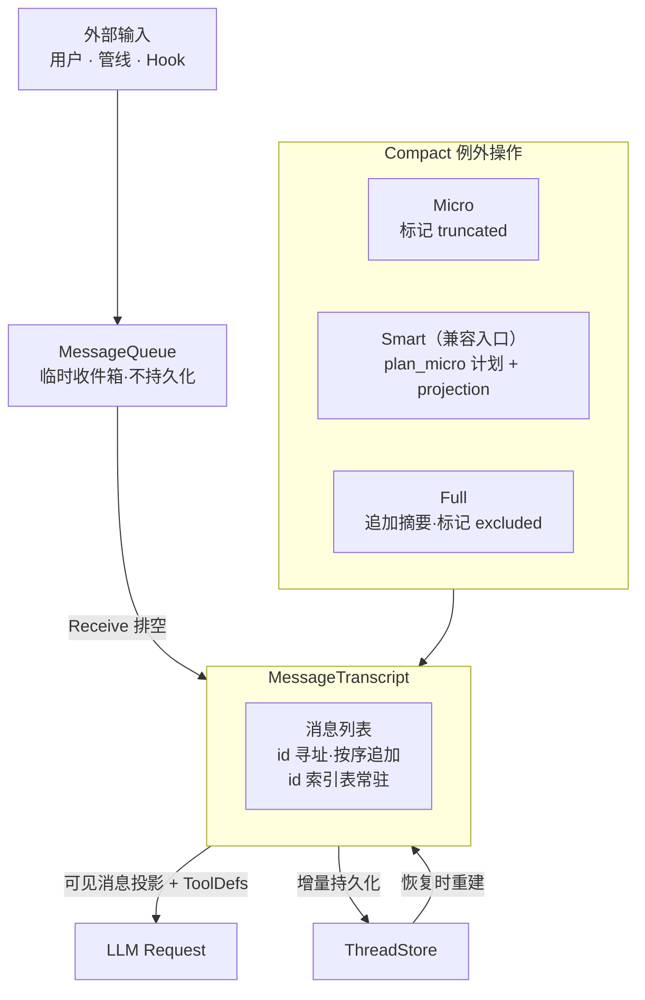

# 会话消息与 Transcript 架构设计

> BaseMessage、ContentBlock 枚举、MessageTranscript 与 staging 事务写
>
> 状态：现行设计
>
> 运行时事实源为 `peri-agent/src/session/transcript.rs`、消息契约类型与相邻测试。

## 1. 设计原则

1. **永远 id 寻址**：每条消息拥有唯一 `MessageId`（UUID v7，时间有序）。所有外部操作——rewind、compact、持久化恢复——一律按 id 定位消息。禁止使用 Vec 下标定位——下标可因消息标记漂移而引入隐性错误。
2. **只追加优先**：正常 ReAct 循环中消息仅尾部追加，禁止 prepend 或中间插入。Compact 保留消息本体，通过标记改变模型视图，Full 另行追加摘要与 re-inject 消息。
3. **修改即新消息**：消息内容不可原地修改。需要变更时，正常路径产生新消息（新 id）。Micro 持久化 projection directive，Full 标 `excluded`；标记不改变消息内容本身。（Smart Compact 为 planner 兼容入口，见 §2.6）
4. **Transcript 为运行时事实源**：运行时从 Transcript 构造消息视图；冷恢复从持久化 payload 与 flags 重建。已提交的 compact 结果跨 turn 保留，包括随后取消或失败的 turn。不持久化 MessageQueue——Queue 是临时收件箱。
5. **追加异步、提交有确认**：普通追加经异步 writer，compact lifecycle 与 turn 收尾必须检查持久化结果。writer 失败后停止使用热会话，保留已落盘内容，重新加载后才能继续；不以删除新增 ID 模拟事务回滚。
6. **标记代替删除**：Compact 不删除、不修改消息内容。Micro 标 `truncated`（LLM 请求时截断输出），Full 标 `excluded`（LLM 请求时跳过该消息）。（Smart Compact 已实现为 planner 兼容入口，见 §2.6）标记可撤销，消息本体不变。仅 rewind 允许真删除。

---

## 2. 总体架构

### 2.1 MessageId 寻址

每条消息拥有唯一 `MessageId`（UUID v7，按时间单调递增）。

- **唯一寻址方式**：所有操作一律通过 id 定位消息。Transcript 内部维护 id→消息的索引表，常驻内存。不存在通过 Vec 下标定位的路径——下标会因 Compact 移除消息而漂移，后果严重。
- **去重保证**：同一 Session 内 MessageId 绝不重复。持久化恢复时执行 id 碰撞检测——碰撞意味着数据损坏。
- **时间有序**：UUID v7 自带时间戳，天然按创建时间排序——Transcript 的消息列表与 id 排序一致。

### 2.2 Transcript 存储

核心容器为消息列表，顺序即对话时间线。尾部追加是唯一正常写入路径。内部通过 id 索引表支持 O(1) 按 id 查找。

- **BaseMessage**：统一消息类型。`content` 为 `MessageContent`（纯文本、ContentBlock 列表、Provider 原生格式）。`content_blocks()` 懒解析，Provider 按需选择最优格式。
- **ContentBlock**：七种变体——Text、Image、Document、ToolUse、ToolResult、Reasoning、Unknown。Transcript 存储完整 ContentBlock。
- **只追加规则**：
  - ✅ Reason 产出的 AI 消息、Act 产出的 ToolResult → 尾部追加
  - ✅ Info 类型消息（含 SystemReminder）经 MessageQueue 中转后尾部追加
  - ✅ `append_batch()` 批量追加——逐条触发独立 `PersistOp::Append`
  - ❌ 禁止 prepend 或中间插入——破坏 Prompt Cache 前缀
  - ❌ 禁止删除或修改——Compact 通过标记改变模型视图，不改变消息本体
- **代码位置**：`BaseMessage` / `ContentBlock` / `MessageContent` 定义于 `peri-agent/src/messages/`；`MessageTranscript` 定义于 `peri-agent/src/session/transcript.rs`；`MessageQueue` 定义于 `peri-agent/src/session/queue.rs`。Transcript 和 Queue 属于 session 模块，messages 模块仅含消息数据类型定义。
- **ancestor 边界**：SubAgent 引用父上下文时，将 payload 与 flags 一起冻结为版本化 `InheritedContext`，恢复时先放 ancestor、再放 child own history；父会话后续 compact 不改变该快照。祖先标记允许初始化恢复，普通标记 setter 与 compact lifecycle 拒绝改写祖先。ACP `session/fork` 是独立会话复制：复制后的 payload 使用新 `MessageId` 并归新 thread 所有，因此属于可压缩 own region，而非共享 ancestor。
- **Staging 两阶段写入**：Reason 阶段产出的 AI 消息（含 tool_calls）不直接追加到 Transcript——先 Staging。Act 阶段收集所有 ToolResult 后，AI 消息 + ToolResult 作为一组原子提交到 Transcript。Staging 期间的消息 LLM 请求不可见。提交后触发持久化。若 Act 阶段异常终止（Cancel/Error），staging 消息丢弃——Transcript 回到本轮开始前的状态，不留半个 AI 消息。

### 2.3 MessageQueue

临时收件箱，独立于 Transcript，**不持久化**。冷重建会话时 Queue 从空开始；同一宿主会话跨 turn 共享队列实例。实现位于 `peri-acp-types/src/session/queue.rs`，Agent session 模块保留 re-export。

用户尚未获准消费的内容保存在 Agent `UserInputMailbox` 待发区，不能提前进入本消费 MQ。
只有指定发送或运行协调允许的内容才交接，Receive 领取与 Stop 精确撤出共享同一队列锁。
完整投递和恢复语义见[用户待发送队列](user-input-queue.md)。

#### MessageKind 三类消息

消息按 Kind 分为三类，控制循环唤醒和消费行为：

| Kind | 来源示例 | `drain_all` 行为 | 唤醒新 turn |
|------|---------|----------------|------------|
| `Prompt` | 用户输入、外部主动请求 | 消费（写入 Transcript） | ✅ |
| `Defer` | SubAgent 完成、Cron 触发、延迟结果 | 消费（写入 Transcript，emit `SyntheticUserMessage`） | ✅ |
| `Info` | SystemReminder、Hook 注入 | 消费（写入 Transcript） | ❌ |

#### MessageSource 九种来源

每条 `QueuedMessage` 携带 `MessageSource` 标注来源，用于调试和事件追踪：`UserInput` / `SubAgentComplete` / `GoalSteering` / `CronTrigger` / `StopHookFeedback` / `ChannelMessage` / `SystemInjected` / `ToolFailureWarning` / `WorkflowComplete`。

#### 排空 API（RCRA 重构后）

- **`drain_all()`**（`peri-acp-types/src/session.rs:222`）：Receive 阶段一次性消费队列中全部消息（Prompt + Info + Defer），写入 Transcript。原 `drain_for_receive` / `drain_for_end` 双排空 API 已移除——RCRA 重构后 Receive 是唯一队列消费点，End 阶段不再单独消费 Defer（见 `peri-agent/src/agent/stages/receive.rs:12-16` 与 `agent/session/inbox.rs:11` 注释，二者仅剩注释提及）。
- **`has_wake_up()`**（`session.rs:231`）：Receive 消费后队列空且无工具调用时，退出判断前检查队列是否还有可唤醒消息（Prompt 或 Defer）——有则继续循环，无则退出（见 `stages/mod.rs:649`）。Info 永远不会单独唤醒循环——必须被 Prompt 带出。

### 2.4 持久化

ThreadStore 负责 Transcript 的完整持久化。`ThreadStore` trait 定义已下沉 `peri-acp-types/src/store.rs:41`，实现迁至 `peri-resources/src/sessions/`（`filesystem.rs` 的 `FilesystemThreadStore` / `sqlite_store.rs` 的 `SqliteThreadStore`），`thread/mod.rs` 仅 re-export。

#### ThreadStore trait 核心方法概览

| 方法 | 职责 |
|------|------|
| `create_thread` / `delete_thread` | Thread 生命周期管理 |
| `append_messages` / `append_message` | 增量追加消息（append_message 默认复用 append_messages） |
| `load_messages` / `load_context` | 加载全部消息 / 含祖先链 + 缓存的完整上下文 |
| `store_inherited_context` / `load_inherited_context` | 子会话冻结继承 payload 与 flags；未知版本或损坏快照拒绝加载 |
| `load_meta` / `update_meta` / `update_title` | 元数据读写 |
| `list_threads` / `list_child_threads` / `list_session_threads` | Thread 列举与层级遍历 |
| `update_thread_status` / `invalidate_context_cache` | 状态与缓存管理 |
| `delete_messages` / `delete_messages_since` | 精确删除 / 按 id 后缀删除（rewind 用） |
| `update_message_flags` | 更新 compact 标记（truncated / excluded），默认 no-op |

- **触发时机**：消息追加到 Transcript 后异步触发持久化；compact lifecycle 先 flush 追加，再原子提交摘要与标记。turn 收尾检查 writer 结果。
- **增量持久化**：仅追加新消息；compact 标记变更 UPDATE、新增消息 INSERT。rewind 触发 DELETE。
- **Compact 标记**：Micro 标记 `truncated`、Full 标记 `excluded`。标记持久化同步（UPDATE 标记字段，不修改 content）。Full 追加新 Human 消息（INSERT）。Smart Compact 为 planner 兼容入口，标记与 Micro 一致（见 §2.6）。
- **失败恢复**：host 对可信的执行结果采纳 canonical payload 快照，不以 `ok` 决定是否更新历史。writer 错误、compact 提交结果不确定或缺失执行结果会使热会话失效；冷加载恢复磁盘已提交的 payload 与 flags，不能把已提交摘要视为脏数据删除。失败的追加不自动补写。

### 2.5 Rewind

按 MessageId 将会话回滚到指定消息，撤销其后所有操作。

- **操作**：指定目标 id → Transcript 截断至该消息（含）→ id 索引表同步收缩 → 持久化层删除该 id 之后的所有记录 → MessageQueue 清空。
- **文件系统回滚**：rewind 到某消息时，该消息之后产生的临时文件（如输出落盘文件）同步清理。仅保留回滚点之前的文件系统状态。
- **恢复**：回滚后的会话从该点继续，ReAct 循环正常启动。

### 2.6 与 Compact 的交互

Compact 保留消息本体，通过标记改变可见性或模型投影；Micro directive 随 writer 持久化并在收尾检查，Full lifecycle 在存储确认成功后发布摘要与标记的内存状态。三种模式的策略：

| Compact 模式 | 重建策略 | 持久化影响 |
|-------------|---------|-----------|
| Micro | 保留全部消息，部分标 `truncated: true` | UPDATE 标记字段 |
| Full | 追加新摘要消息，旧消息标 `excluded: true` | INSERT 摘要 + UPDATE 旧消息标记 |
| Smart（已实现为兼容入口） | 经 `plan_micro` 生成计划后应用，未选中消息标 `truncated` + projection directive | UPDATE 标记 + INSERT projection directive |

- Micro 和 Full 两种已实现模式通过标记实现——Micro 标 `truncated`，Full 标 `excluded`。消息不删，标记可撤销。rewind 清标记恢复原状
- Smart Compact 已实现为 planner 兼容入口（`peri-agent/src/agent/compact_v2/smart.rs`）：不再走独立 LLM 筛选分支，而是通过 `plan_micro` 生成计划再应用（`set_flags_projection` 统一持久化 directive），并带 deprecation warning（"will be removed, converging to Micro"）；`compact_v2` 已目录化（原 `compact_v2.rs:57` stub 位置不复存在）
- Full 将新摘要、re-inject 消息和旧消息 excluded transitions 作为同一 lifecycle 提交。后续取消或失败不撤销已提交事务；恢复须保持摘要与 flags 配对。提交前置 pending 状态，只有存储确认成功并应用内存后才标记 committed；取消或错误留下的不确定状态由自动 executor 与手动命令 interceptor 传播给 host，不能仅以普通 writer barrier 成功确认一致性。

### 2.7 与 v2 其他模块的关系

| 模块 | 关系 |
|------|------|
| **Session** | Transcript 是 Session 核心实体之一。Session 创建时 Transcript 为空，销毁时丢弃。CronOwner 由 AcpSession（session 级）持有，跨 turn 存活；SessionInbox 为 session 级 lazy-init，cron/channel 事件经 inbox 唤醒 executor，绕过 TUI 轮询 |
| **LLM 适配器** | Reason 过滤 excluded 并恢复已提交 projection 构造 ModelRequest，即使关闭自动 compact 也恢复投影。无 directive 时使用 canonical 可见消息，不在 Reason 规划新 Micro。Token 计数在 LLM adapter 层完成 |
| **ReAct 循环** | Receive 将 Queue 消息写入 Transcript。Act 将工具结果写入 Transcript |
| **AgentGroup** | Fork Agent 创建时 Transcript 全量 Copy |
| **Hook 系统** | Hook 不能直接写 Transcript——通过 MessageQueue 注入 |
| **事件流 / TUI** | `visible_messages()` 过滤 excluded 标记返回可见消息（LLM 请求构造用）；`visible_snapshot()` 返回 `Arc<Vec<BaseMessage>>` 快照，用于 TUI 事件传递（如 TurnCompleted 事件）。Transcript 变更产生事件，外部据此刷新 UI |
