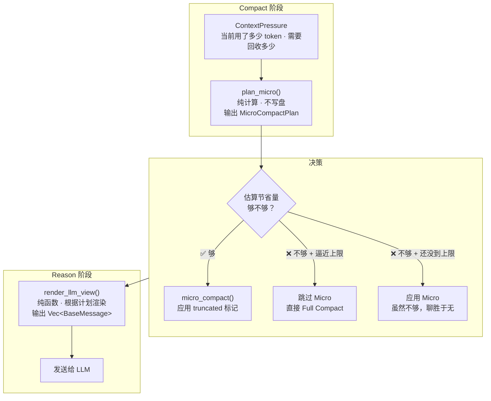
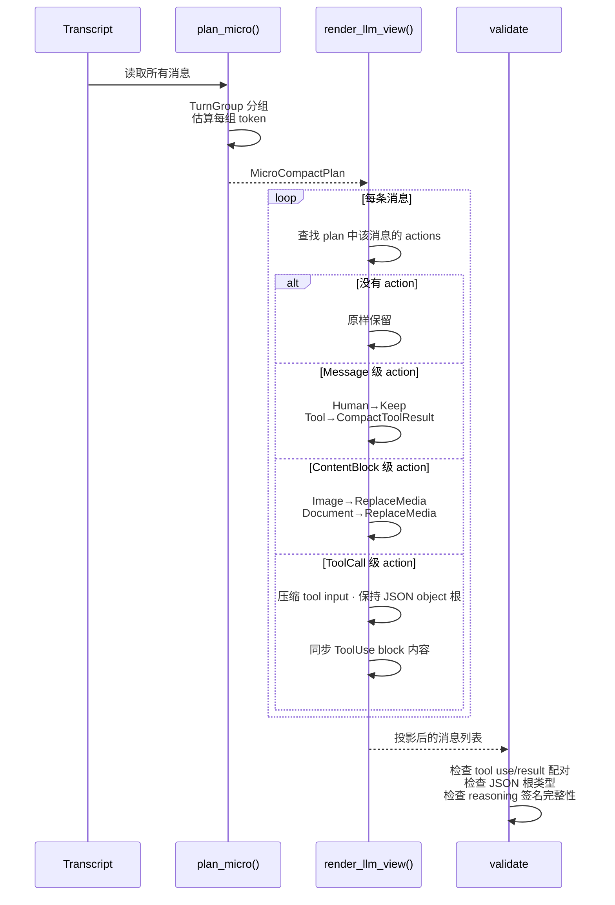
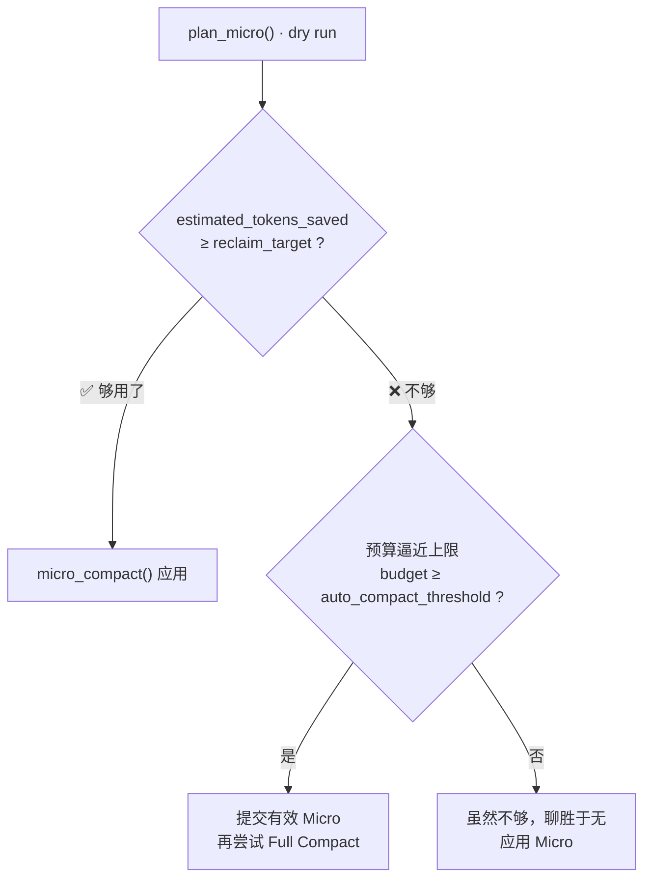

# Micro Compact 投影引擎设计

> 状态：现行设计
>
> 运行时事实源为 `peri-agent/src/agent/compact_v2/` 与相邻测试。

## 1. 背景

旧版 Micro Compact 有四个设计问题，导致实际压缩效果不可靠：

1. **标记了但不生效**：`micro_compact()` 给消息打 `truncated` 标记，但 Reason 阶段用 `truncated_content(100)` 只处理 `Text` 类型的消息。如果消息是 `Blocks` 格式（含 Image/Document），Base64 payload 原样发送给 LLM——标记白打了。
2. **工具调用被连带伤害**：一条 AI 消息可能同时调用 Bash 和 AskUserQuestion。旧版以消息为单位打标记——Bash 要截断，AskUserQuestion 也被一起截了。
3. **JSON 结构被破坏**：截断 tool input 时把 `{"path": "/a", "content": "..."}` 截成字符串再写回，导致 `Value::Object` 变 `Value::String`，provider adapter 看到不一致的数据。
4. **效果用"标记了几条"衡量**：一条 10KB 的 Bash 输出和一条 10 字节的 Read 输出权重相同。

新版围绕四个独立阶段重建了 Micro Compact：

```text
分析上下文压力 → 生成压缩计划（纯计算，不写盘） → 构造 LLM 视图（纯函数） → 应用标记并报告
```

---

## 2. 总体架构



整个流程中唯一有副作用的步骤是 `micro_compact()`——它修改 Transcript 的 flags，并异步写数据库。`plan_micro()` 和 `render_llm_view()` 都是纯函数。

### 2.1 模块关系

| 模块 | 做什么 |
|------|--------|
| `compact_v2/planner.rs` | `plan_micro()`——生成压缩计划（纯函数）。还包含 `TurnGroup` 分组逻辑和 `ContextPressure`。 |
| `compact_v2/projection.rs` | `render_llm_view()`——根据计划把 Transcript 渲染成 LLM 可见的消息列表（纯函数）。 |
| `compact_v2/mod.rs` | `run_compact()`——串联 planner + 决策 + 应用。 |
| `compact_v2/micro.rs` | `micro_compact()`——调用 planner 生成计划，然后应用 `truncated` 标记。只有 ~20 行。 |
| `compact_v2/smart.rs` | `smart_compact()`——规则驱动的消息保留策略，同样通过 planner 生成计划。已收缩为 `plan_micro` 兼容入口（带 deprecation warning，趋向 Micro Compact）。 |
| `compact_v2/config.rs` | `CompactConfig` 纯数据契约已归位 `peri-acp-types::compact`（配置来源为外部配置文件，跨层共享），本文件仅保留 re-export 保兼容。 |
| `stages/reason.rs` | Reason 阶段——调用 `render_llm_view()` 获取压缩后的消息列表，替代旧版 `truncated_content(100)`。 |
| `stages/compact.rs` | Compact 阶段——构建 `ContextPressure`，调用 `run_compact()`，填充事件字段。 |

---

## 3. 分组模型：TurnGroup

旧版把单条消息当成一个 round，仅在 AI 后面紧跟对应 ToolResult 时把它们合并。这种简化模型遇到插入消息或异常顺序就会出错。

新版引入显式的 `TurnGroup`：从 Human 消息开始，收集后续的 AI 消息及其所有 ToolResult，直到下一条 Human。一条真实用户交互对应一个 TurnGroup。

```
TurnGroup #1:
  Human:  "帮我查文件"
  AI:     tool_calls=[Bash(call_1), Read(call_2)]
  Tool:   call_1 = "file not found"
  Tool:   call_2 = "content: ..."

TurnGroup #2:
  Human:  "改成这样"
  AI:     tool_calls=[Write(call_3)]
  Tool:   call_3 = "written"
```

每个 TurnGroup 内部，tool_use 和 ToolResult 的配对关系通过 `ToolExchange` 显式记录——tool_call_id 相同的是一对。压缩时这对关系不可拆分：不能删了 tool_use 留着 ToolResult，反过来也不行。

### 3.1 与 Micro 的关系

`plan_micro()` 跳过最近 `micro_compact_stale_steps`（默认 3，`peri-acp-types/src/compact.rs:120`）个 TurnGroup——最近几轮对话通常还在活跃使用中，不需要压缩。更早的 TurnGroup 才会被逐一检查并生成压缩动作。

---

## 4. 投影引擎

投影引擎回答一个问题：**下一次 LLM 请求应该看到什么内容？**

旧版把这个逻辑写在 Reason 阶段里——遍历消息，看到 `truncated` flag 就调 `truncated_content(100)`。问题是 `truncated_content` 只处理 `Text` 类型，Image/Document/ToolUse 全部穿透。

新版把这个逻辑独立成一个纯函数 `render_llm_view()`：输入 Transcript + MicroCompactPlan + ProviderCapabilities，输出 LLM 可见的消息列表。**不修改 Transcript**。

### 4.1 投影粒度

压缩不是"一条消息截不截"这么粗。同一条 AI 消息里可能有一个 Bash 调用（参数很长，可以压缩）和一个 AskUserQuestion（工具调用，必须保留）。新版用三级粒度区分：

| 粒度 | 什么时候用 | 例子 |
|------|-----------|------|
| 整条消息 | 工具输出（ToolResult）——整条消息做 head/tail 截断 | Bash 的 stdout 输出 |
| 消息内的一个 block | Image/Document 类型的 ContentBlock——把 Base64 替换成文本占位符 | 用户发的截图 |
| 消息内的一个工具调用 | AI 消息中的某个 tool_call——只压缩这个调用的参数 | Bash 的 command 参数 |

三级粒度由 `ProjectionTarget` 枚举表示。

### 4.2 投影动作

`ProjectionAction` 枚举定义了六种投影方式：

| 动作 | 对什么用 | 效果 |
|------|---------|------|
| **Keep** | Human 消息、System 消息、错误输出、受保护的工具 | 原样保留 |
| **CompactToolResult** | 普通工具的输出 | 保留前 N 个字符和后 N 个字符，中间省略 |
| **CompactToolInput** | 工具的输入参数 | 替换为 `{"_compact_note": "已压缩"}`，保持 JSON object 格式 |
| **CompactText** | 普通文本 | 截断到 max_chars 字符，追加 `[内容已压缩]` |
| **ReplaceMedia** | Image / Document block | 移除 Base64 payload，换成 `[图片已压缩: ...]` 文本 |
| **Exclude** | 整块内容 | 替换为 `[已排除]` |

### 4.3 CJK 安全截断

旧版用 `&s[..N]` 截断中文文本会导致 panic（切在 UTF-8 多字节字符中间）。新版用 `chars().take(N)` 按字符边界处理：

```
原始: "这是一段很长的输出内容...exit code 0"
截断 (head=20, tail=10):
  → "这是一段很长的输出内容...\n... [500 字符已省略] ...\nexit code 0"
```

### 4.4 Provider 差异

不同 Provider 对消息格式有不同的限制。`ProviderCapabilities` 记录这些差异：

| Provider | 特点 | 影响 |
|----------|------|------|
| OpenAI | 无签名机制 | reasoning 可以局部截断 |
| Anthropic | reasoning 块带签名 | 带签名的 reasoning 必须整体保留或整体移除，不能局部截断 |

`ProviderCapabilities` 通过 `AgentModelBridge`（即 `peri_model::Model` trait）获取。Anthropic 实例返回 `signed_reasoning_must_be_whole = true`，OpenAI 返回 `false`。`render_llm_view()` 据此决定 reasoning 块的处理方式。

### 4.5 投影流程



---

## 5. Planner：压缩计划

`plan_micro()` 是一个纯函数——读 Transcript 和配置，输出 `MicroCompactPlan`。不写数据库、不修改 Transcript。这是 dry-run 决策的前提。

### 5.1 上下文压力

旧版只用百分比（"当前用了 80%"）决定要不要压缩。但实际上需要知道的是"需要回收多少 token"，而不是"用了百分之几"。

新版引入 `ContextPressure`，核心方法是 `target_reclaim_tokens()`：

```
需要回收 = 当前 token 数 - (模型窗口 - 输出预留 - 预测增长 - 安全余量)
```

如果当前 token 数还没超过目标，返回 0（用 `saturating_sub`）。

百分比仍然用于 Compact 触发判断——但决策以显式回收量 `target_reclaim_tokens()` 为准。

### 5.2 计划内容

`MicroCompactPlan` 包含：

- **actions**：压缩动作列表。每条是 `(消息id, 目标粒度, 做什么动作)` 的三元组，不包含消息内容副本
- **estimated_tokens_saved**：估算能省多少 token（chars / 4 保守估算）
- **target_reclaim_tokens**：需要回收的目标量

关键是 `estimated_tokens_saved`——决策流用它替代旧版 `affected_count`（"标记了几条消息"）。一条 10KB 的 Bash 输出估算节省 ~2500 token，一条 10 字节的 Read 输出估算节省 ~2 token，权重天差地别。

### 5.3 工具保留策略

哪些工具不压缩？旧版用 `micro_excluded_tools: Vec<String>` 黑名单——不断往里加工具名，容易出现"先放开全部工具，再补保护名单"的回归循环。

新版引入 `ContextRetention`，作为 `BaseTool` 的 trait 方法：

| 分类 | 含义 | 例子 |
|------|------|------|
| **Preserve** | 不可压缩——默认值 | AskUserQuestion、goal、TodoWrite |
| **StateBearing** | 后续控制流依赖的状态 | Agent 任务描述 |
| **SideEffectReceipt** | 副作用已完成，只需保留收据 | Bash 执行完成后的输出 |
| **Recomputable** | 可从磁盘或网络重建 | Read 的文件内容 |

`plan_micro()` 决定是否保留一个工具时，先查 `config.tool_retention_map`（集中配置），再回退到工具自身的 `context_retention()` 方法。

---

## 6. 决策流

### 6.1 旧版的问题

仅凭 `affected_count`（标记了几条）无法判断是否需要升级 Full：少量长结果可能释放较多预算，许多已隐藏结果则没有新的可回收量。决策应使用当前可见模型视图的增量收益估算。

### 6.2 新版 dry-run 决策

新版先跑 `plan_micro()`（纯函数，无副作用），拿到 `estimated_tokens_saved`，然后做三路决策：



当 Micro 回收量不足且预算达到 Full 阈值时，先提交有效 Micro，再尝试 Full；Full 失败时保留已经取得的 Micro 收益。planner 与收益估算都跳过 excluded 消息，且只规划 own region，不能把 Full 已排除的历史重复算作可回收量。stale round 也只从当前可见 own history 计算。

压力样本由有效 provider usage generation 与 canonical 工具结果增长 generation 共同标识；同一样本只自动尝试一次。Act 提交工具结果后计入估算，下一次有效 input usage 结清估算；missing/zero usage 不清账。预算中已包含该增长，不能再次扣减 headroom。

### 6.3 Full 后预算验证

成功 Full 后，Reason 将实际请求与该 Full generation 绑定，用对应响应的有效 input usage 检查是否降到 `auto_compact_threshold` 以下。没有新增用户或工具工作时，连续两次 Full 后仍高压会返回 `CompactBudgetUnrecovered`，结束本轮；cancel 优先。AI 输出、摘要和 canonical Reminder 不重置次数，新的用户或工具工作开启新一轮验证。未知、零或过期 usage 不作为进展证据。此保护限制无工作进展的重复压缩，不删减保留的 Reminder。

### 6.4 缓存感知

高缓存命中率 + 充足 headroom 的情况下，compact 可以推迟——缓存还在有效期内，提前压缩反而损失缓存带来的 token 节省。

当 `cache_aware_enabled = true` 且 `cache_hit_rate > 0.7` 且 headroom > 20% 时，跳过本次 compact。

### 6.5 Shadow Mode

当 `shadow_mode_enabled = true` 时，只跑 `plan_micro()` 估算，不应用任何标记。日志输出估算值。用于校准 chars→tokens 估算模型——对比估算值与下一次真实 LLM 请求的 `input_tokens`。

---

## 7. 持久化

### 7.1 MessageFlags 扩展

旧版 `MessageFlags` 只有 `truncated` 和 `excluded` 两个布尔字段。新版新增 `projection` 字段——存储投影指令，支持 session 恢复：

```
MessageFlags {
    truncated: bool,    // Micro 标记
    excluded: bool,     // Full/Smart 标记
    projection: Option<MessageProjectionDirective>,  // v2 新增：投影指令
}
```

`MessageProjectionDirective` 包含 `policy_version`（策略版本）和 `entries`（仅含本消息的 action 列表）。不包含 BaseMessage 内容或 Base64——可以安全序列化到 SQLite。

### 7.2 批量写入

旧版每条 `truncated` 标记都发一条 `PersistOp::UpdateFlags` 给 writer task，writer 每条都单独 `invalidate_context_cache`——N 条消息 N 次 cache invalidation。

新版新增 `PersistOp::ApplyCompactionBatch`：writer task 循环内逐条更新数据库，循环外只做**一次** cache invalidation。

### 7.3 Session 恢复

SQLite 的 `projection TEXT` 列通过幂等迁移添加。恢复时 `load_message_flags()` 同时读取、反序列化 projection。Reason 仅渲染已提交且有效的 directive，无 directive 时使用 canonical 可见消息；此恢复不依赖自动 compact 是否启用。子会话另行持久化继承 payload 与 flags 的冻结快照，避免父会话后续 compact 改变 child 视图。完整恢复契约见 `ARC-COMPACT-001` 与 [会话消息设计](message-transcript.md)。

---

## 8. 新增配置

| 字段 | 默认值 | 用途 |
|------|--------|------|
| `target_headroom_tokens` | `0` | 目标 headroom token 数 |
| `tool_result_keep_chars` | `200` | ToolResult head/tail 保留字符数 |
| `shadow_mode_enabled` | `false` | 只估算不应用 |
| `cache_aware_enabled` | `false` | 高缓存命中时延迟 compact |
| `tool_retention_map` | `{}` | 工具名 → ContextRetention 映射 |

---

## 9. 新增事件字段

`CompactCompleted` 事件新增 9 个字段，覆盖建议稿中提出的全部可观测性需求：

| 字段 | 说明 |
|------|------|
| `estimated_tokens_saved` | 估算节省量（替代 `affected_count` 做主要指标） |
| `estimated_tokens_before` | 投影前 token 估算 |
| `estimated_tokens_after` | 投影后 token 估算 |
| `changed_messages` | 实际产生内容变化的消息数 |
| `changed_fields` | 实际变化的字段数 |
| `no_op_candidates` | 候选但无实际变化的条目数 |
| `full_escalation_reason` | 升级到 Full 的原因 |
| `cache_hit_rate_before` | 压缩前缓存命中率 |
| `strategy` | 新增 `Skip` 变体（cache-aware / shadow mode） |

---

## 10. 测试覆盖

| 模块 | 文件 | 测试数 | 重点 |
|------|------|--------|------|
| projection | `projection_test.rs` | 8 | Image/Document 移除、ToolInput 根类型、head/tail 截断、CJK 安全、signed reasoning |
| planner | `planner_test.rs` | 8 | token 估算、TurnGroup 分组、retention map、并行 tool exchange |
| micro | `micro_test.rs` | 9 | 基本截断、错误保护、retention 排除 |
| trigger | `trigger_test.rs` | 9 | estimated_tokens_saved 反映、多轮次增长、完整 pipeline |
| smart | `smart.rs` 内联 | 8 | 空 transcript、stale 窗口、idempotent、ancestor 保护 |
| compact v2 | `_test.rs` | 4 | CompactResult 字段、escalation reason |
| transcript | `transcript_test.rs` | - | projection 持久化、批量恢复 |
| sqlite_store | `sqlite_store_test.rs` | 1 | SQLite projection 列读写 |
| adapters | `anthropic_test.rs` / `openai_test.rs` | - | Provider 协议序列化 |

---

## 11. 问题修复清单

| 编号 | 问题 | 怎么修的 |
|------|------|---------|
| P0-1 | Blocks/Raw 打了标记但不投影 | `project_content()` 处理所有 ContentBlock 类型，`render_llm_view()` 替换 `truncated_content(100)` |
| P0-2 | `affected_count` 不是真实收益 | `estimate_tokens()` + `estimated_tokens_saved` 决策 |
| P0-3 | 同一条 AI 消息的工具调用被连带 | `ProjectionTarget::ToolCall { tool_call_id }` 粒度 |
| P0-4 | Tool input 的 JSON 结构被破坏 | `project_tool_input()` 保持 `Value::Object` 根类型 |
| P1-1 | 100 字符截断丢失恢复信息 | `apply_head_tail()` head+tail+省略提示 |
| P1-2 | round 分组太简化 | `TurnGroup::collect()` + `ToolExchange` 配对 |
| P1-3 | Micro 后跑 Full 白写标记 | dry-run → 不足时跳过 Micro apply |
| P1-4 | 百分比触发没有回收目标 | `ContextPressure::target_reclaim_tokens()` |
| P2-1 | N 次 cache invalidation | `ApplyCompactionBatch` 单次 invalidate |

---

## 12. 关键设计决策

1. **Planner 纯函数**：`plan_micro()` 零副作用。这是 dry-run、Skip-Micro-when-Full、shadow mode 的前提。如果不纯，每一步决策都可能产生不可逆的副作用。

2. **Micro 收缩为 thin wrapper**：核心逻辑在 planner 和 projection。`micro_compact()` 只有 ~20 行——调 planner、应用 flag。Smart 同样通过 planner 兼容入口。保持代码焦点集中。

3. **默认 Preserve**：`ContextRetention` 默认值是 `Preserve`——没有显式声明的工具一律不压缩。旧版黑名单默认是空的（全部压缩），过于激进。

4. **Token 估算用 chars/4**：不使用复杂 tokenizer。预留 shadow mode 校准路径——对比估算值和真实 `input_tokens`。

5. **保留 `affected_count` 兼容**：新逻辑以 `estimated_tokens_saved` 为主，但旧字段保留——事件消费者（TUI、Langfuse）不需要同步迁移。
