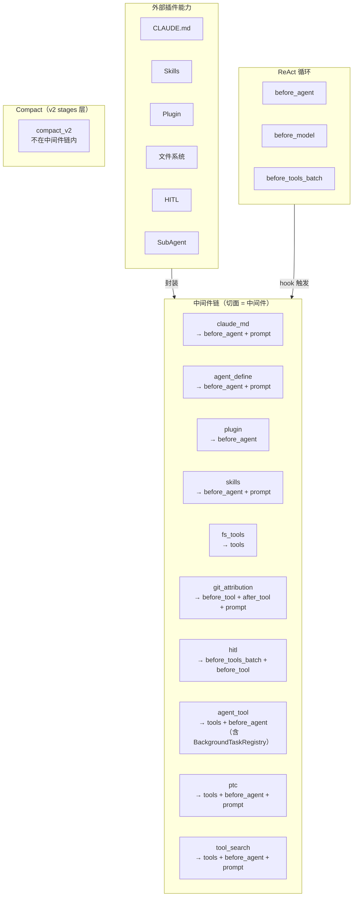

# Middleware 系统设计

> 状态：现行设计
>
> 链序事实源为 `peri-agent/src/session/factory.rs::production_blueprint`，装配实现为
> `peri-middlewares/src/assembly.rs`；强制顺序契约见 ARC-MIDDLEWARE-001。

## 1. 设计原则

1. **切面即中间件**：一个切面就是一个中间件。每个切面封装一个独立的外部能力——hook 实现 + 工具声明 + System Prompt 贡献的自包含单元。不再有「中间件容器套切面」的嵌套结构。
2. **单一职责**：每个切面只做一件事。Agent 注册是独立切面；Background 任务通过 `BackgroundTaskRegistry` 嵌入 `SubAgentMiddleware`（`with_background_registry()`），不作为独立切面存在。
3. **声明式注册**：切面通过声明方式注册 hooks、tools、依赖关系。声明在编译期可检查完整性。
4. **固定顺序，不可重排**：切面在链中的排列顺序是契约。同一 hook 点上多个切面按声明顺序执行。[TRAP]
5. **State 为唯一共享上下文**：切面间不直接通信——所有状态变更通过 State 传递。

---

## 2. 总体架构



### 2.1 切面（中间件）——能力的封装单元

一个切面是单一能力的声明。它即是一个中间件：

| 声明项 | 说明 |
|--------|------|
| **Hook 挂载** | 声明在哪些生命周期点执行逻辑。hook 事实源为 `peri-agent/src/middleware/trait.rs`，执行顺序由 `peri-agent/src/middleware/chain.rs` 与 stages 中的 runner 锁定；设计文档不复制动态 hook inventory |
| **工具声明** | 声明提供哪些工具，Executor 统一收集注册 |
| **System Prompt 贡献** | 声明需要追加到 System Prompt 的文本片段 |
| **条件守卫** | 声明注册条件（如「仅当权限模式非 Bypass 时注册」） |

切面可以不挂载任何 hook——纯工具提供者（如 Filesystem）只需声明 tools，零 hook。

### 2.2 执行模型

链是扁平的——直接遍历切面：

```
Hook 触发（如 before_model）
  → 遍历链中的切面（声明顺序）
    → 执行切面在该 hook 上的挂载逻辑
```

- 遇错即停——后续切面跳过，错误向上传播
- 批量处理（before_tools_batch）：切面声明支持批量模式时 Engine 自动批量化，否则退化为逐条调用

### 2.3 工具收集

Executor 遍历链中所有切面的 `collect_tools` 声明，统一收集：

```
for aspect in chain:
  for tool in aspect.collect_tools(cwd):
    collect(tool)
```

- 工具工厂接收 cwd 参数动态创建
- `collect_tools` 阶段按 production chain 顺序收集；每个 fresh stage 的
  `build_session_tool_view` 将其合并进 session-local `BTreeMap`，同名 middleware
  工具按后注册覆盖，宿主级 `shared_tools` 不被改写
- `AskUserQuestion` 与其他 middleware 工具一致，由
  `HumanInTheLoopMiddleware::collect_tools()` 提供；关闭该 middleware 后即从
  当前 session-local 工具视图消失

---

## 3. 切面注册表

生产蓝本包含 26 个槽位；Hook 槽位可按非空 hook group 展开为多个实例，
MCP / Workflow / LSP / Goal 等槽位还受运行时依赖约束。顺序事实源是
`peri-agent/src/session/factory.rs::production_blueprint`：

> 注：Compact 已从中间件链移除，由 v2 stages/compact.rs 在 ReAct 循环每轮开头处理。详见 §6。

| # | 切面 | 挂载 Hook | 提供工具 | Prompt 贡献 | 条件 |
|---|------|----------|---------|------------|------|
| 1 | default_system_prompt | — | — | 基础 prompt sections | — |
| 2 | lang | — | — | language section | — |
| 3 | claude_md | before_agent | — | CLAUDE.md contribution | — |
| 4 | agent_define | before_agent | — | — | — |
| 5 | plugin | before_agent | — | — | — |
| 6 | skills | before_agent | Skill/DiscoverSkills | Skills contribution | — |
| 7 | skill_preload | before_agent | — | — | — |
| 8 | at_mention | before_agent | — | — | — |
| 9 | image | before_agent | — | — | — |
| 10 | filesystem | — | Read/Write/Edit/Glob/Grep/folder | — | — |
| 11 | git_attribution | before_agent, before_tool, after_tool | — | Git Attribution contribution | — |
| — | git_watch | before_agent, after_tool | — | — | 链上位于 #11 与 #12 之间；[git-watch-middleware.md](git-watch-middleware.md) |
| 12 | terminal | — | Bash | — | — |
| 13 | web | — | WebFetch/WebSearch | — | — |
| 14 | todo | — | TodoWrite | — | — |
| 15 | cron | — | Cron 工具组 | — | — |
| 16 | hook | 配置声明的 hooks | — | — | 非空 hook groups；可展开多实例 |
| 17 | permission | before_tools_batch, before_tool | — | 10_hitl section | — |
| 18 | ask_user | — | AskUserQuestion | 12_ask_user section | — |
| 19 | subagent | before_agent | Agent（+AgentResultTool） | 11_subagent section | — |
| 20 | mcp | before_agent, before_model | MCP 工具（动态） | — | mcp_pool 非空 |
| 21 | workflow | before_agent | Workflow 编排工具（deferred） | — | workflow executor/adaptor 非空 |
| 22 | ptc | before_agent | RunPtcCode（deferred） | PTC 安全语义与 RPC catalog contribution | 默认装配 |
| 23 | tool_search | before_agent | SearchExtraTools/ExecuteExtraTool | deferred inventory + direct declarations contribution | 默认装配 |
| 24 | artifact | — | artifact（direct） | — | — |
| 25 | lsp | — | LSP 工具 | — | lsp_servers 非空 |
| 26 | goal | after_agent | Goal（deferred） | — | goal_controller 非空 |

**脚注**：
- **#5 plugin**：`PluginMiddleware` 在 `before_agent` hook 中执行插件兼容性校验（name/version/manifest 字段完整性）。
- **#11 git_attribution**：`before_tool` 暂存 Write/Edit 旧文件内容，`after_tool` 计算贡献字符数；`prompt_contribution()` 声明 Co-Authored-By 指令。
- **#17/#18**：审批与提问是独立能力。`PermissionMiddleware` 负责审批；`HumanInTheLoopMiddleware::collect_tools()` 使用原始 broker 提供 `AskUserQuestion`。
- **#19 subagent**：`SubAgentMiddleware` 提供 `Agent`，TaskManager 可用时额外提供 `AgentResultTool`；后台完成事件走独立 unbounded channel。
- **#22/#23**：PTC 必须先于 ToolSearch。两者都在 `before_agent` 基于当前 session-local 工具视图生成 contribution；ToolSearch 随后为包含 `RunPtcCode` 的 deferred 集合建索引。
- **#26 goal**：`GoalTool` 是 deferred tool，仅通过 `SearchExtraTools` → `ExecuteExtraTool` 访问；`after_agent` 注入 steering 并触发自驱续跑。

---

## 4. 顺序约束

链中切面的排列顺序即依赖关系。不需要单独的 `requires` 字段——排在前面的先执行，排在后面的依赖前面的产出：

- `claude_md` 排在 `permission` 之前——先注入上下文，再审批
- `permission` 排在 `subagent` 之前——其 `before_tools_batch` 在 Agent 工具实际执行前完成审批
- 信息注入切面（claude_md、skills）排在 `goal` 之前——goal 追踪需要上下文已就绪
- 工具切面（filesystem、terminal、web 等）排在 `tool_search` 之前——工具索引需完整工具列表

顺序即契约。新增切面时按依赖关系插入对应位置。

---

## 5. System Prompt 贡献

切面通过声明替代 prepend_message 模式：

- 切面声明 `prompt_contribution()` 文本片段（返回 `Option<String>`）
- frozen/base system prompt 在 session snapshot 中保持不变
- 主 Agent 的 `AgentModelBridge` 在每个 `ModelRequest` 构造时，从与
  `StageContext` 共享的同一 `Arc<MiddlewareChain>` 同步收集一次当前贡献
- 非空贡献按 `base + "\n\n" + contributions` 只追加到当次请求；空贡献不改变 base
- `before_agent` 先于首个 Reason，因此 PTC 与 ToolSearch 的首轮 cache 已就绪；
  provider 返回 owned `String`，不会持有锁跨越模型 await
- 不再进入 `state.messages`

**当前贡献者列表**（`prompt_contribution()` 返回 `Some` 的中间件）：
| 中间件 | 贡献内容 |
|--------|---------|
| agents_md (#3) | CLAUDE.md 摘要 |
| skills (#6) | Skills 摘要 |
| git_attribution (#11) | Co-Authored-By 指令 |
| ptc (#22) | RunPtcCode 安全语义与当前 RPC-callable tool catalog |
| tool_search (#23) | 当前 deferred inventory 与 direct-tool declarations |

> 实际拼接顺序按 §3 的生产链顺序，因此 PTC contribution 位于
> ToolSearch contribution 之前。

---

## 6. 与其他模块的关系

| 模块 | 关系 |
|------|------|
| **Session** | `session/new` 时决定切面注册集合，链按此构建 |
| **ReAct 循环** | hook 点嵌入 ReAct 循环固定检查点 |
| **System Prompt** | 切面通过声明贡献，不通过 prepend_message |
| **工具系统** | 切面声明 tools，Executor 统一收集 |
| **Compact** | 已从中间件链移除（`CompactMiddleware` 已删除）。自动 compact 由 `peri-agent::agent::stages::compact` 在 RCRA 循环中处理；旧版固定阈值仅是历史实现参数，不作为当前约束。当前策略与回收目标以 `docs/design/micro-compact.md` 和 `ContextPressure::target_reclaim_tokens()` 为事实源。Compact 不再作为切面参与链执行 |
| **Plugin** | `PluginMiddleware`（#5）是基础中间件，在 `before_agent` hook 中执行插件兼容性校验。插件扩展的 Skills 通过 `SkillsMiddleware.with_plugin_roots()` 注入，Hooks 通过 `HookMiddleware`（#16，可多实例）注入 |
