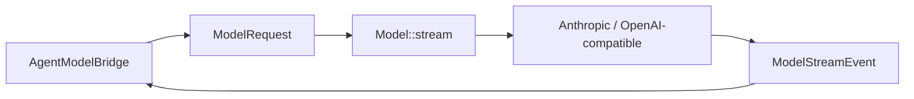

# Model Adapter 架构设计

> 状态：现行设计
>
> Provider 协议类型与执行行为以 `peri-model/src/`、
> `docs/code-index/peri-model.md` 和相邻契约测试为准。

## 1. 设计边界

`peri-model` 只负责 provider 无关的模型协议、HTTP/SSE transport、重试、响应解码与
安全观测投影。Agent 业务语义、Transcript、工具调度与客户端事件不进入该 crate。

Agent 侧 `AgentModelBridge` 是 `peri-model` 与 ReAct 的边界：它把
`BaseMessage`/tool definitions/system prompt 转成 `ModelRequest`，再把
`ModelStreamEvent` 转成 Agent 的 `Reasoning` 与 v2 观察/渲染事件。

## 2. 统一协议

公共协议事实源位于 `peri-model/src/protocol/`：

- `ModelMessage`、`ContentBlock`、`ToolCall`、`ToolResult` 描述输入输出内容；
- `ModelRequest` 与 `ModelResponse` 描述一次调用；
- `ModelStreamEvent` 只包含 TextDelta、ReasoningDelta、ToolCallDelta、Usage、
  Completed；
- `Model` trait 的唯一 provider 调用入口是 `stream()`；`complete()` 只是聚合同一
  stream，不是第二条非流式 transport；
- 流必须以且只以一个 `Completed(ModelResponse)` 收尾。EOF、协议错误或取消不能伪造
  Completed。

新增公共协议类型必须经 `protocol/mod.rs` 与 `lib.rs` 统一 re-export。Provider 私有
字段留在 adapter 内，不能泄漏给 Agent 迫使上层按 provider 分支。

## 3. Provider Adapter

Anthropic 与 OpenAI-compatible adapter 都实现三项核心职责：

1. `prepare_request`：构造可安全观测的 provider-native 请求投影；
2. `stream`：经公共 HTTP/SSE runtime 发起请求并返回统一事件流；
3. 请求/响应映射：在统一 `ContentBlock` 与 provider wire JSON 之间无损转换。

映射必须保持 assistant tool call 与 tool result 配对、reasoning/signature、usage 与
stop reason 语义。新增 `ContentBlock` 变体时，需要同步两端请求映射、响应映射和
文本提取逻辑；不支持的内容必须显式拒绝或按 adapter 契约降维，不能静默丢失。

System Prompt 的 cached/uncached seam 由
`peri_model::prompt_cache::SYSTEM_PROMPT_DYNAMIC_BOUNDARY` 传递。支持显式 cache
breakpoint 的 adapter 消费该 seam；其他 adapter 只做字节守恒剥离。详见
[System Prompt 设计](system-prompt.md)与 ARC-SERIAL-001。

## 4. 流、取消与重试

`ModelStream` 持有 parent cancellation token 的 child token。取消本流只能停止本次
模型调用，不能反向取消父级 session。Completed 后流终止；流提前结束返回稳定协议
错误。

重试由 `peri-model/src/runtime/retry.rs` 统一执行：

- 仅配置声明为可重试的传输/HTTP 类错误进入退避；认证、权限和协议错误直接失败；
- 一旦已经发出用户可见 delta，后续传输失败视为 interrupted，不得重新调用并重复
  输出；
- retry observer 只接收安全摘要与时序字段，不得携带请求正文、响应正文或凭据；
- jitter、最大尝试次数与错误分类由 `ModelRuntimeConfig` 提供，Agent 不复制重试器。

## 5. 观测与秘密

API key 只存在于 provider config/model 内。Debug、错误、tracing、Langfuse input 和
测试 fixture 都不得输出完整凭据。`PreparedModelRequest::observe` 负责生成安全观测
投影，对敏感键、data URI、超长值与非安全字段做脱敏或截断；完整观测只能通过显式
配置开启，并仍服从 ARC-SECRET-001。

Provider 配置由 ACP 装配面构造并注入，不由 `peri-model` 读取环境变量。URL 必须限制
到 adapter 支持的 scheme，并拒绝 userinfo 等凭据旁路。

## 6. 新增 Provider 检查清单

1. 实现 `Model::capabilities`、`prepare_request` 与 `stream`。
2. 覆盖全部 `ContentBlock`、tool call/result、usage 与 stop reason 映射。
3. 使用公共 HTTP/SSE、取消与 retry runtime，不创建平行 transport。
4. 消费或安全剥离 system prompt cache 控制字，wire 上不得泄漏。
5. 提供 config/error/observation 脱敏测试。
6. 在 `peri-acp/src/provider/mod.rs` 的 provider 工厂显式注册；不得被现有通配分支
   意外吞掉。
7. 运行 provider 相邻测试、`cargo test -p peri-model --lib`，并检查
   ARC-EVENT-001 与 ARC-SERIAL-001 的跨层影响。
