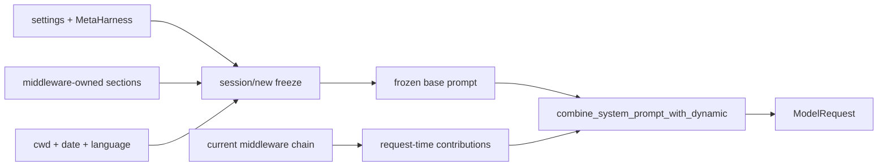

# System Prompt 构建系统设计

> 状态：现行设计
>
> 冻结、能力闭包与缓存边界的强制不变量分别见 ARC-FROZEN-001、
> ARC-CAPABILITY-CLOSURE-001 与 ARC-SERIAL-001；自定义覆盖机制见
> [MetaHarness 设计](meta-harness.md)。

## 1. 设计边界

System Prompt 由两部分组成：会话级冻结的 base prompt，以及每次模型请求读取的
middleware contribution。两者都独立于 Transcript，不得伪装成 user/system 消息
写入对话历史。

- base prompt 在 `session/new` 时随日期、项目指引、skill 摘要与 MetaHarness 状态
  一起冻结和持久化；load、resume、fork 与 SubAgent 复用同一 owner snapshot；
- middleware contribution 由当前 session 的同一条生产链提供，在 `before_agent`
  完成能力目录准备后，于构造 `ModelRequest` 时同步读取；
- contribution 只能追加到冻结 base 之后，不能重写缓存前缀，也不能绕过当前
  session-local capability policy；
- System Prompt 不进入 Transcript，Compact 与 rewind 不修改它。

## 2. 所有权与段落来源

基础段、语言、审批、提问、Skills、SubAgent 等提示词分别由对应 middleware 持有。
middleware 缺席时，其工具、hook 和段落必须同时消失；不能保留“能力可用”的静态
说明。生产链与条件装配以 `peri-agent/src/session/factory.rs::production_blueprint`
及 `peri-middlewares/src/assembly.rs` 为准。

MetaHarness 在冻结期按 section ID 替换持有者提供的段落内容，并按 middleware 名关闭
整个能力。section ID 与 middleware 名清单的代码事实源是
`peri-acp-types/src/meta_harness.rs`。运行时不得另建平行清单。

未被 middleware 持有的兼容段必须显式 feature-gate；当前 `15_channel` 的 gate 恒关闭。
新增能力时必须同时确定：段落所有者、session-local 开关、工具/route/event/TUI 暴露面
以及 SubAgent/Workflow 继承语义。

## 3. 构建与冻结

冻结 snapshot 是 write-once owner state。legacy thread 缺 snapshot 时只能按
ARC-FROZEN-001 的 CAS 回填路径恢复；未知版本、损坏数据或存储错误必须 fail closed。
fork 继承 source snapshot 的精确字节，不能以当前磁盘内容重新生成。

request-time contribution provider 返回 owned `String`，不得持锁跨越模型 await。空
contribution 必须保持 base prompt 字节不变。贡献顺序按 production chain 顺序，任何
依赖 `HashMap` 迭代生成 prompt 的实现都违反 ARC-SERIAL-001。

## 4. 缓存边界 transport

`peri_model::prompt_cache::SYSTEM_PROMPT_DYNAMIC_BOUNDARY` 是跨 `String` handoff 保留
cached/uncached seam 的唯一控制字。`combine_system_prompt_with_dynamic` 将 request-time
contribution 放在边界之后；provider 在构造 wire request 前必须消费控制字，wire 上
不得泄漏。

- 支持显式 cache breakpoint 的 adapter 只在恰有一个控制字时拆分静态/动态 system
  block；重复控制字全部剥离并对显式缓存 fail closed；
- 不支持显式 breakpoint 的 adapter 只做字节守恒剥离，不宣称控制 provider 的隐式
  缓存；
- 无控制字输入是否采用 legacy fallback，由具体 adapter 契约决定。

Anthropic 当前使用显式 system block cache seam；OpenAI-compatible 保留 system 字节
顺序并剥离控制字。详细 provider 行为见 [Model Adapter 设计](model-adapters.md)。

## 5. 能力关闭与安全边界

关闭能力必须覆盖 direct tools、deferred index/resolver、slash route、ACP/TUI 投影、
prompt/examples 以及 SubAgent/Workflow 继承，不能只删除提示词。审批与提问是两项独立
能力：`PermissionMiddleware` 持有审批语义，`HumanInTheLoopMiddleware` 持有
`AskUserQuestion`；关闭其中一项不得改变另一项。

覆盖安全相关段落是显式的强能力，但不能改变运行时授权事实。模型文本中的
“always/never”不能替代 policy、HITL、tool view 或 transport 的代码级检查。

## 6. 验证

- `cargo test -p peri-acp --test prompt_cache_boundary`
- `cargo test -p peri-acp --lib prompt`
- `cargo test -p peri-model --lib -- system_cache`
- `cargo test -p peri-middlewares --lib assembly_test`
- `cargo test -p peri-middlewares --lib frozen_claude_md`

变更段落所有权或关闭面时，还要运行 capability presence/absence 矩阵，并按
DOC-UPDATE-001 同步对应标准与模块路由。
