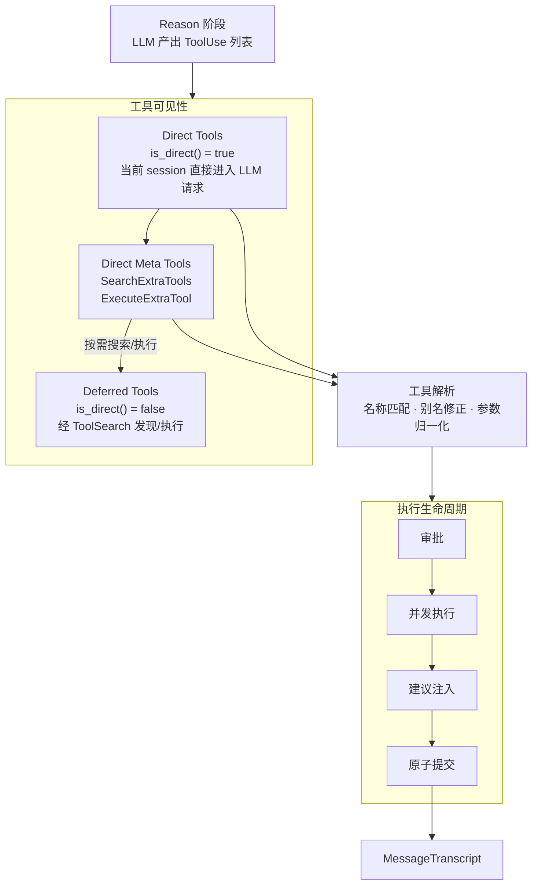

# 工具系统架构设计

> 状态：现行设计
>
> 工具可见性与执行边界的强制不变量见 ARC-TOOLS-001；运行时事实源为
> session-local tool view、`peri-agent` dispatch 与 `peri-middlewares` ToolSearch。

## 1. 设计原则

1. **工具无状态**：工具实例不持有可变状态。同一工具实例可被多个 Agent 并发调用，互不干扰。执行所需上下文（cwd、对话历史）通过只读引用传入，不写回。
2. **渐进式可见性**：工具由 `BaseTool::is_direct()` 分为 Direct（直接进入 LLM tools）与 Deferred（经 ToolSearch 按需发现）。`SearchExtraTools` / `ExecuteExtraTool` 是 Direct 元工具；具体可见集合以每个 session/turn 经过 middleware disabled 与 agent filter 后的本地工具视图为准。
3. **原子提交**：一轮工具调用的 AI 消息和全部 ToolResult 一同写入 MessageTranscript。不产生孤儿 tool_use——任何时候，所有 ToolUse 都有配对的 ToolResult。
4. **工具失败不中断循环**：工具执行失败不终止 ReAct 循环。错误结果写入 Transcript 后，由 LLM 在下一轮自行判断后续。
5. **审批在调用前**：编辑类工具在真正执行前完成 HITL 审批。审批拒绝产生结果记录而非跳过，保持 Transcript 完整。

---

## 2. 总体架构



### 2.1 BaseTool 契约

所有工具的根 trait（定义已下沉 `peri-acp-types/src/tools.rs:79`）。定义工具对外暴露的接口，不约束内部实现。

- 工具向 LLM 暴露三要素：名称、描述、参数 Schema。LLM 依据这三要素决定是否调用及如何传参
- **描述契约（v1.4）**：描述从单个字符串升级为结构化 `ToolDescription`（`name`/`description`/可选 `title`/可选 `namespace`），并支持提示词层声明模板。详见 [2.5 工具描述契约与提示词层声明](#25-工具描述契约与提示词层声明v14-新增)
- 工具执行入口接收 LLM 生成的输入和只读上下文，返回执行结果
- 工具不能直接修改 AgentState——所有副作用通过返回值表达，由 dispatch 层统一写入 Transcript

**只读上下文**：工具可感知对话历史和工作目录，但不能修改。只读约束保证工具无法绕过原子事务写入。

**别名契约**：LLM 的调用请求常有偏差。工具可声明别名，让系统在调用前透明纠正，而非报错。

- **参数别名**：工具声明常见参数名的别名映射。LLM 使用别名传参时，系统自动映射到正名再调用工具。典型场景：LLM 常混淆 `path` 和 `file_path`，工具声明后系统自动纠正。
- **名称别名**：工具声明常用名称的别名映射。LLM 使用别名调用时，系统自动路由到正确工具。典型场景：LLM 可能把 Agent 叫 task、Bash 叫 shell。
- **Meta 展开**：通过 Meta 工具调用的 Deferred 工具时，从参数中提取真实工具名和参数，路由到目标。

别名是契约的一部分——工具声明"我接受这些别名"，系统据此纠正 LLM 错误。不声明则不纠正。

**输出控制**：工具可声明输出处理偏好，系统在 `post_process_result` 中据此优化资源使用。

- **超时**：`timeout()` 默认 120s，适用于 Read/Edit/Glob 等快速操作。Agent/Bash 等长时间运行工具返回 `None`，由内部自行管理超时。外层 dispatch 以此超时包裹工具执行。
- **截断**：`output_char_limit()` 声明输出字符数上限（`None` 表示不截断）。超出部分自动截断并标注省略量。避免大体积输出撑爆上下文、淹没其他工具结果。
- **落盘**：`prefers_persist()` 返回 `true` 时，系统倾向于将结果写入临时文件，Transcript 仅保留引用。产生大输出的工具（如 Bash、WebFetch）适用此能力。Read 工具无需——文件内容本就从磁盘读取。

### 2.2 工具可见性

Skills 不是工具——它们通过 System Prompt 注入行为指令，不走工具系统。工具可见性只有 Direct / Deferred 两类，分类事实源是 `BaseTool::is_direct()`（默认 `false`）。“Core”仅可作为高频 direct 工具的概念称呼，不是运行时静态白名单。

| 类型 | LLM 可见性 | 职责 | 事实源 |
|------|-----------|------|--------|
| Direct | 当前 session 中直接可见 | 高频工具及桥接元工具 | session-local 工具视图中 `is_direct() = true` |
| Deferred | 不直接可见 | 低频或动态注册工具 | session-local 工具视图中 `is_direct() = false`，进入 ToolSearch 索引 |

`SearchExtraTools` 与 `ExecuteExtraTool` 由 `ToolSearchMiddleware` 注册，是 Direct 元工具。`ArtifactTool` 则由独立 `ArtifactMiddleware` 注册，当前 `is_direct() = true`；它只使用 `meta` namespace 分组，并不属于 ToolSearchMiddleware 或 Deferred/ToolSearch 执行路径。

工具集合先由 middleware 收集，再应用 disabled middleware 与 agent allowlist/disallowlist 过滤，形成每 turn 的 session-local 工具视图。ToolSearch 的 direct 能力说明、deferred 索引和最终 LLM tools 都必须从该视图派生，不能从静态名称清单推断。

**Deferred 工具来源**：Cron 定时任务、MCP 外部服务（`mcp__{server}__{tool}`）、LSP 语言服务、Plugin 插件（`plugin:{name}:{server}` 前缀命名空间）、Workflow 工具等；是否进入 Deferred 最终仍由各工具的 `is_direct()` 决定。

### 2.3 工具执行生命周期

- **审批**：编辑类工具执行前走 HITL，通过 `before_tools_batch` 批量处理接口一次性收集所有需审批的项，弹出一个多工具审批弹窗（而非逐个阻断）。只读工具跳过。拒绝不跳过——生成结果记录一同提交。
  - **决策类型**：Approve（放行）、Edit（修改参数后放行）、Reject（拒绝）、Respond（拒绝 + 自定义消息）
  - **权限模式**：Default（逐个审批）、AcceptEdit（自动批准编辑类）、AutoMode（LLM 自动分类审批）、Bypass（全部跳过）。模式通过 `SharedPermissionMode`（`Arc<AtomicU8>` 封装）跨线程共享，支持运行时动态切换（`cycle()` 按 Default → AcceptEdit → AutoMode → Bypass 循环）。
- **并发执行**：全部工具同时启动，互不等待。
- **AskUserQuestion**：阻断自身等待用户输入，其他工具照常并发。用户回答作为 ToolResult 一同提交。
- **建议注入**：工具执行失败后、写入 Transcript 前，系统通过 `post_process_result` 注入建议。已在 `ToolEnd` 事件 emit 之后执行。
  - **注入时机**：仅当 `is_error = true` 时触发。建议文本追加到错误输出末尾，不改变 `is_error` 标记——LLM 看到增强后文本自行判断，错误事实不被掩盖。
  - **已实现的建议器注册表**：`build_default_registry()` 按短路顺序注册 7 个 suggester——参数语法类（廉价）在前、IO/查询类在后：
    1. `JsonSchemaSuggester`：参数 JSON Schema 校验错误
    2. `GlobPatternSuggester`：Glob 模式语法错误
    3. `RegexSuggester`：正则表达式语法错误
    4. `RangeSuggester`：数值/索引越界错误
    5. `PathSuggester`：文件路径不存在或模糊匹配建议（需 IO）
    6. `BashCommandSuggester`：Bash 命令拼写错误建议（需 PATH 扫描）
    7. `SubagentSuggester`：SubAgent 名称拼写错误建议（需 registry 查询）
  - **扩展点**：`ErrorSuggester` trait 可独立增删，按短路匹配顺序——首个返回 `Some(Suggestion)` 的 suggester 生效。
- **原子提交**：一轮工具调用的提交是不可分割的整体。
  - **事务范围**：本轮 AI 消息 + 全部 ToolResult。
  - **异常保证**：cancel、超时、审批拒绝——所有路径下，每个 ToolUse 都有配对的 ToolResult。
  - **永不产生孤儿**：成功、失败、拒绝、中断——各有明确的结果记录。

### 2.4 工具搜索

Meta 工具（SearchExtraTools / ExecuteExtraTool）是 LLM 发现和调用 Deferred 工具的通道。

- **SearchExtraTools**：按关键词搜索可用 Deferred 工具，返回匹配列表。LLM 据此判断是否有合适工具再决定调用。
- **ExecuteExtraTool**：按工具名和参数直接执行 Deferred 工具。LLM 先搜索、再执行——两步走而非一步到位。
- **搜索范围**：Deferred 工具来自多个来源——Cron 定时任务、MCP 外部服务、LSP 语言服务、Plugin 插件、Workflow 工具。各来源独立注册到 `shared_tools`，搜索时合并结果。

#### 2.4.1 搜索算法

`ToolSearchIndex` 实现了 TF-IDF + 关键词混合搜索引擎（`tool_index.rs` + `keyword_search.rs`），评分公式：

```
score = keyword_score × 0.4 + tfidf_score × 0.6
```

**查询语法**：
- `select:CronCreate,Snip` —— 按精确名称查找，逗号分隔，直接返回匹配工具
- `+slack message` —— `+` 前缀词为必选词（`required`），其余为可选关键词（`optional`）。必选词缺失时该工具硬过滤为 0 分
- `slack message` —— 纯关键词搜索

**分词策略**（`tokenize`）：
- CJK 字符逐字分割（每个汉字/日文/韩文字符为独立 token）
- ASCII 按空格/下划线/连字符分割，全部转小写

**关键词评分**（`keyword_score`）：
- 必选词全部匹配 → 基础分 1.0，任一缺失 → 硬过滤 0.0
- 可选词匹配 → 每个 +0.3
- 工具名精确匹配 → +0.5
- 描述精确匹配 → +0.2（匹配长度 ≥ 3）
- 子串匹配要求双方长度 ≥ 2

**工具名分词**（用于关键词匹配）：
- CamelCase 分词：`CronCreate` → `["cron", "create"]`
- MCP 前缀拆解：`mcp__slack__send_message` → `["slack", "send_message"]`（跳过 `mcp` 前缀）

**TF-IDF 评分**：
- 加权分词：name 权重 3.0，description 权重 2.5
- IDF 公式：`ln(N / (df + 1))`，N 为文档总数，df 为包含该词的文档数
- 向量余弦相似度计算最终 TF-IDF 分数

#### 2.4.2 索引构建与缓存失效

`ToolSearchIndex` 使用 `content_version`（`AtomicU64`）追踪索引变更：

- 每次 `build()` 全量重建时，`content_version` 原子递增（`fetch_add`）
- `set_cached_prompt()` 记录当前 `content_version` 到 `cached_prompt_version`
- 中间件在 `before_agent` 中比对 `content_version()` 与 `cached_prompt_version()`：
  - 二者不一致 → cached_prompt 已 stale，触发重新构建
  - 一致但 `total_count()` 与实际 deferred 工具数不匹配 → 也触发重建

此机制解决"同 count 但不同 content"场景——例如 MCP 重连后工具数量相同但描述/schema 已更新，单纯数量比对会漏掉变化。

#### 2.4.3 Session-local Direct 能力说明与 Prompt Cache

`ToolSearchMiddleware::before_agent` 从当前 turn 的本地工具视图收集实际 direct 工具名，并以稳定字典序生成 `SearchExtraTools` / `ExecuteExtraTool` 的能力说明。未装配、被 middleware 禁用或被 agent filter 排除的工具不得被描述为当前可直接调用。

`peri-middlewares/src/tool_search/core_tools.rs` 仍保存若干工具名常量，供解析、分类或测试复用；它们不是运行时能力白名单。历史实现曾维护 `CORE_TOOL_NAMES` 并把固定清单写入元工具 description，该做法已退役，因为它会与 session-local 工具视图漂移。

稳定排序只保证同一实际集合生成确定性文本，以减少无意义的 prompt cache 波动；能力集合本身仍随 session 配置与过滤结果变化。

---

## 2.5 工具描述契约与提示词层声明（v1.4 新增）

> 参照 grok-build 的 `ToolDescription`（name/description/title/namespace 结构）与
> `description_template` 模板渲染模式设计；提示词合并复用现有 middleware
> `prompt_contribution` 机制（`peri-agent/src/middleware/chain.rs`、
> `peri-agent/src/agent/model_bridge.rs`）。

### 2.5.1 ToolDescription 契约

工具向 LLM 与提示词层暴露的描述从"单个字符串"升级为结构化 `ToolDescription`
（落点 `peri-acp-types/src/tools.rs`，与 `BaseTool` 同文件）：

```rust
#[derive(Debug, Clone, Serialize, Deserialize, PartialEq)]
pub struct ToolDescription {
    pub name: String,              // 模型调用名（必填，与 name() 一致）
    pub description: String,       // 模型向完整描述（必填，进入 API tools 列表）
    pub title: Option<String>,     // 短显示名（提示词层声明与 UI 展示引用）
    pub namespace: Option<String>, // 分组（提示词层按组组织声明段）
}
```

**字段语义**：

- **description**：模型向，决定 LLM 何时调用、如何传参。写作规范见 2.5.4。
- **title**：短显示名（≤ 6 词，名词短语）。缺省时由 `name` 推导——CamelCase /
  snake_case 拆词：`AskUserQuestion` → `Ask User Question`、`folder_operations`
  → `Folder Operations`（对齐 grok-build "If absent, derive the title from name"）。
- **namespace**：同类工具分组（如 `filesystem`、`web`、`meta`）。缺省不分组。
  提示词层按 namespace 分组组织声明段；MCP/Plugin 等外部工具缺省继承其来源名。

**BaseTool trait 扩展**（全部带默认实现，现有工具零改动）：

```rust
fn title(&self) -> Option<&str> { None }
fn namespace(&self) -> Option<&str> { None }
fn tool_description(&self) -> ToolDescription { /* 组装 name/description/title/namespace */ }
/// 提示词层声明模板；返回 None 表示不出现在提示词声明段（默认）。
fn prompt_declaration(&self) -> Option<String> { None }
```

**序列化投影**：线上契约 `ToolDefinition`（name/description/parameters）**不变**。
`title`/`namespace` 仅存在于进程内契约与提示词层，不下发 API——OpenAI/Anthropic
function calling 无对应字段（对齐 grok-build `ToolDefinition` → `FunctionTool` 投影）。

**三类型边界**（避免混淆）：`ToolDescription`（本契约，提示词层/UI 消费面）≠
`ToolDefinition`（peri-acp-types，事件快照消费面）≠ `ModelToolDefinition`
（peri-model protocol，LLM 请求消费面，name/description/input_schema）。
三者独立定义，`ToolDescription` 不参与事件序列化与 LLM 请求投影。

### 2.5.2 提示词层声明机制

工具显式声明 + request-time 合并，复用现有 `prompt_contribution` 链路：

```
before_agent（ToolSearchMiddleware）
│
├─ 1. 遍历当前 session-local 工具视图中 is_direct() = true 的工具，
│      收集所有非 None 的 prompt_declaration()
├─ 2. 渲染占位符（见 2.5.3）
├─ 3. 按 (namespace 字典序, name 字典序) 排序——跨会话输出字节级稳定
├─ 4. 拼接为单段贡献文本，与 deferred 工具列表合并后写入 cached_contribution
│      （Arc<StdRwLock<Option<String>>>，同款 AgentsMdMiddleware 的
│      cached_contribution + prompt_contribution 模式；锁类型不同——
│      ToolSearch 用 std::sync::RwLock，AgentsMd 用 parking_lot::RwLock）
│
└─ prompt_contribution() 返回缓存文本
        ↓
AgentModelBridge 构造每个 ModelRequest 时，从与 StageContext 共享的
Arc<MiddlewareChain> 同步收集一次，并追加到不变的 frozen base prompt 尾部
```

要点：

- **声明入口**：`prompt_declaration()` 是工具对提示词层的唯一出口——05 段落
  工具条目的程序化来源（全量迁移后 05 仅保留通用纪律，见 2.5.5）。
- **参与集 = 当前 LLM 可见集**：运行时集合为 session-local 工具视图中
  `is_direct() = true` 的工具，并已应用 middleware disabled 与 agent filter。
  ToolSearch 元工具的能力说明也从同一集合生成。Deferred 工具走
  SearchExtraTools 索引（2.4），数量不可控，不进声明段。
- **合并策略**：`cached_contribution` 原承载 deferred 工具列表（索引
  `cached_prompt()`），声明段与之**拼接共存**——deferred 列表在前、声明段在
  后，`\n\n` 分隔；任一段为空时只保留另一段。不得覆盖 deferred 列表
  （LLM 丢失"当前可用 deferred 工具"提示即功能回归）。
- **失效路径**：声明段不走索引 `content_version` 失效路径——每轮
  `before_agent` 独立重渲染，输出仅依赖工具静态字段。
- **时序**：`run_react_loop` 在首个 Reason 前完成 `before_agent`；主 Agent 的
  bridge 在每个 `ModelRequest` 构造时，从与 `StageContext` 共享的同一条
  `Arc<MiddlewareChain>` 读取当前 contribution。因此首个 Reason 即包含
  deferred 列表与 direct 声明；fresh stage 会从该 turn 的 disabled/filter 后
  session-local 工具视图重算，不依赖上一 stage 的 middleware cache。
- **组合纪律**：frozen base prompt 本身不被修改，动态段只存在于当次模型请求；
  空 contribution 不追加分隔符，非空时精确组合为
  `base + "\n\n" + contribution`，不会在历史字符串上累加。
- **缓存位置**：声明段位于 prompt contribution（frozen 之后），不参与 Anthropic
  前缀缓存。量小（17 工具 × 1-2 行）可控；若需缓存收益，演进方向为合并进静态
  段落（build_system_prompt 感知工具集），记为未来项；当前保持 request-time
  dynamic contribution，以保证 session-local 能力视图准确。

### 2.5.3 模板语法与渲染

- 占位符共 4 个：`{{name}}`、`{{title}}`、`{{description}}`、`{{namespace}}`，
  渲染时替换为工具对应字段值。
- **未识别占位符原样保留**，由测试强制清零（2.5.6）——宽松保留 + 测试兜底，
  避免渲染失败中断主循环（grok-build 为 debug panic 策略，此处取其纪律、舍其强度）。
- 模板与 system prompt 段落占位符（`{{cwd}}` 等）互不干扰：声明文本的渲染发生在
  middleware `before_agent`，不经过 `build_system_prompt` 的占位符替换。
- 描述正文需展示字面 `{{ }}`（JSON/泛型示例）时，通过 `{{description}}` 间接
  引用完整描述，不在模板中直接书写。

示例（Read 工具）：

```
Read a file → `{{name}}` ({{title}}). Use `{{name}}` for file content, not `cat`/`head`/`tail`.
```

### 2.5.4 写作规范与稳定性纪律

**description 写作规范**（模型向，对齐 grok-build 风格约定）：

- 一句话说明用途 + 何时使用；必要时追加 Usage/注意事项节（多行 Markdown）
- 引用参数名用反引号（`path`），引用其他工具用反引号工具名（`{{name}}` 同义）
- 不写会话数据（cwd、date、项目内容）——工具无状态契约（2.1）
- 长度无硬上限，建议 1-3 句（< 200 词）；超长描述进入后续截断治理范围
  （grok-build 式字节预算 + 三级降级，记为未来项）

**稳定性纪律**（保护 prompt cache 前缀与跨会话一致性）：

- 模板只允许引用工具自身静态字段（4 个占位符）；引用运行时数据的声明禁止
- 声明输出跨会话字节级稳定：确定性排序（(namespace, name) 字典序）——同输入
  同输出；新工具按序插入，相邻文本可能重排，但字节级稳定性由排序保证
- 声明段内容变更（工具描述修改）会使 contribution 变化，但 frozen 前缀不受影响——
  描述迭代不破坏缓存，符合"静态区域冻结、动态区域可演进"原则（peri-agent-system-prompt-v2 第 1 节）

### 2.5.5 与 05_using_tools.md 的关系（全量迁移完成）

05 段落保留**通用纪律**（文件头部的 batch/incremental 规则与 Bash discipline
节，05_using_tools.md:3-4、6-13）与**通用工具选择原则骨架**（"Tool selection
principles" 小节，2 行、不含工具名与逐工具细节）。骨架负责通用选择纪律；
主 Agent 的当前工具声明从首个 Reason 起即通过 request-time contribution 可见，
不再承担 turn-1 声明缺口的 fallback 职责。
当前 direct 工具的 `prompt_declaration()` 按 session-local 工具视图动态参与渲染；常见分组包括
`filesystem`、`execution`、`web`、`interaction`、`skills` 与 `meta`。
声明段是工具选择指引的**单一事实源**（工具代码），05 不再维护
任何工具条目；SubAgent 链的声明装配（声明段进入 subagent 冻结 prompt）记为未来项。
迁移纪律由测试守护（2.5.6）：05 无工具条目残留 + 渲染输出与 05 剩余内容无逐字重复。

### 2.5.6 测试要求

| 测试 | 断言 |
| --- | --- |
| 渲染完整性 | 所有 Core/Meta 工具声明渲染后无未识别占位符残留 |
| 稳定性 | 同一工具集两次收集输出字节级相同（防排序/缓存回归） |
| 排序 | namespace + name 字典序 |
| 迁移守护 | 05 段落无工具条目残留（骨架小节不含工具名）；声明段渲染输出与 05 剩余内容无逐字重复（全量迁移完成态） |
| 缓存保护 | 注入不同 cwd/date 断言声明段输出不变（不引用会话数据） |
