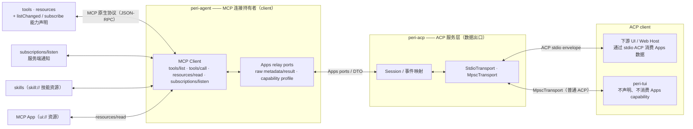
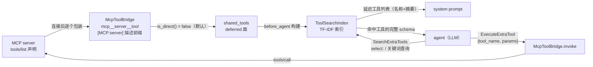
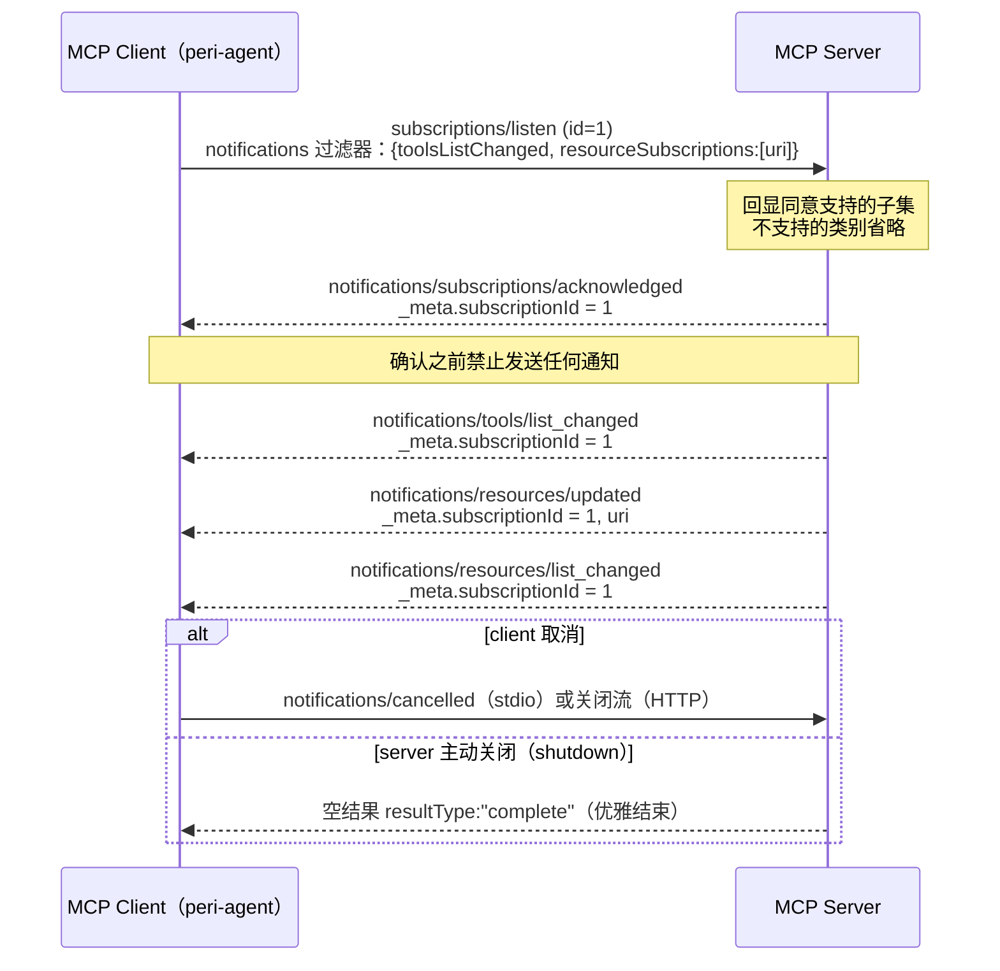
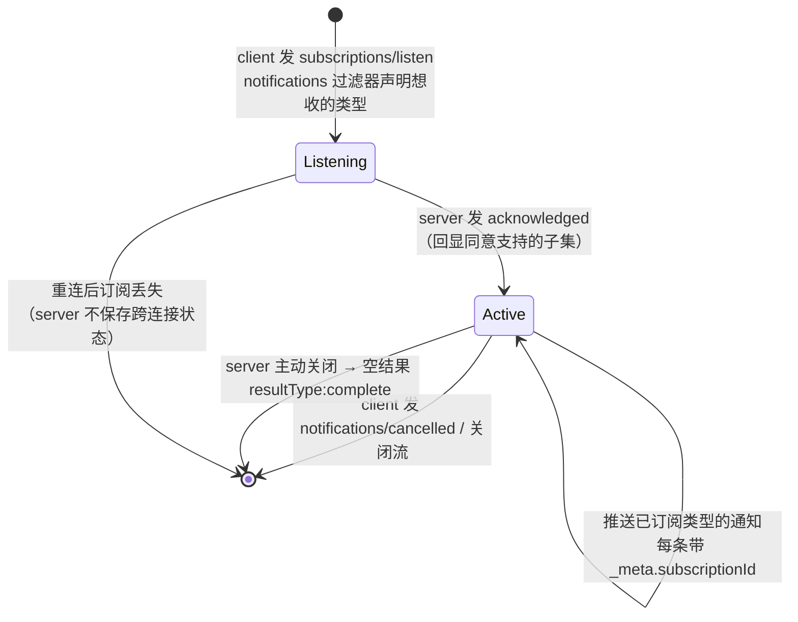
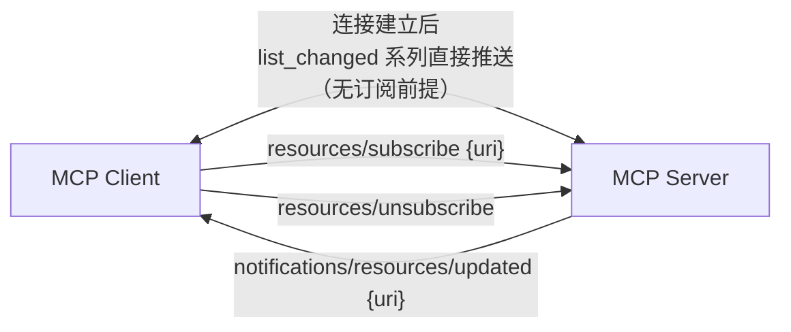
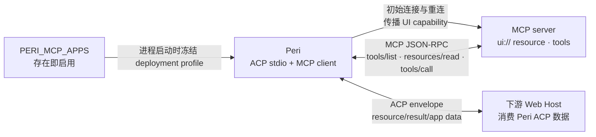
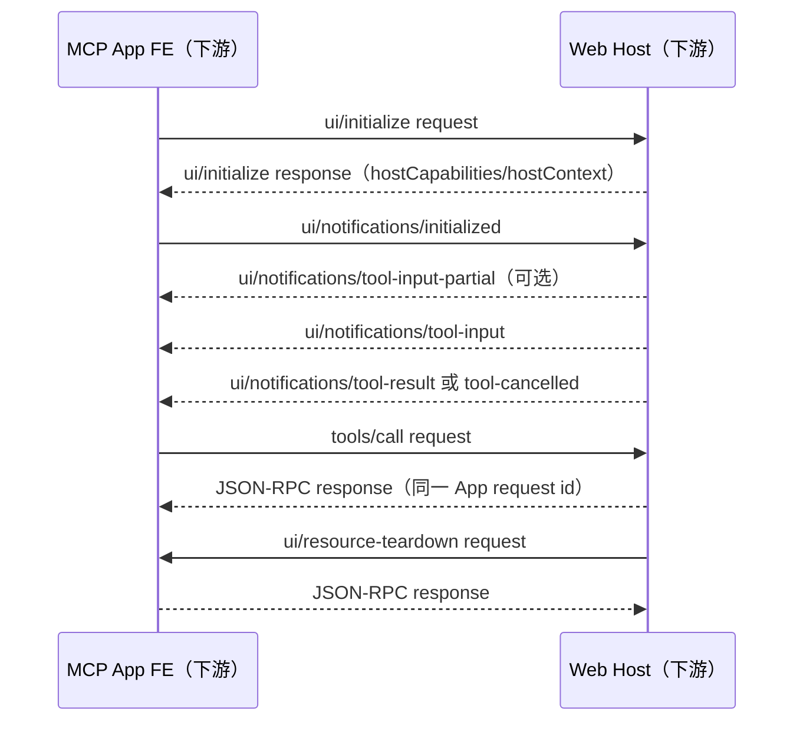

# MCP 生态定位与互通指南（Connector 视角）

> 本文件是生态背景与外部互通参考，不是仓库架构或协议的事实源。Perihelion
> 的 MCP 设计以 `docs/design/dynamic-mcp.md`、
> `docs/design/mcp-multiplexing.md` 和代码契约测试为准。
>
> 实验位置：`side-projects/mcp-apps/`（Node.js + `@modelcontextprotocol/ext-apps` + `@modelcontextprotocol/sdk`）
> 文档定位：说明 MCP 在 perihelion 中的生态角色——**标准的 connector / 通用外部能力对接器**——以及外部开发者如何实现「外部 MCP server ↔ peri 内部」的互通。不搬运规范原文，官方出处见各章末尾链接。

## 目录

- [1. 背景与术语](#1-背景与术语)
- [2. MCP 在 perihelion 中的生态定位](#2-mcp-在-perihelion-中的生态定位)
- [3. tools：可执行动作（核心原语）](#3-tools可执行动作核心原语)
- [4. resources：只读内容通道（核心原语）](#4-resources只读内容通道核心原语)
- [5. subscriptions：服务端通知](#5-subscriptions服务端通知)
- [6. MCP Apps：交互式 UI 扩展（SEP-1865）](#6-mcp-apps交互式-ui-扩展sep-1865)
- [7. skills：技能发现与加载](#7-skills技能发现与加载)
- [8. 外部接入指引](#8-外部接入指引)
- [9. peri 内部落地现状与路径](#9-peri-内部落地现状与路径)
- [10. 参考](#10-参考)

## 1. 背景与术语

### 1.1 两个协议版本

全文所有差异讨论都围绕两个 MCP 规范版本展开，请先建立这个对照意识：

| 版本 | 状态 | 关键差异 |
| --- | --- | --- |
| 2025-11-25 | SDK 当前实现版本 | `@modelcontextprotocol/sdk` 的 `LATEST_PROTOCOL_VERSION` 仍是此版本；订阅机制为 `resources/subscribe` RPC |
| 2026-07-28 | 规范新版 | 引入 `subscriptions/listen` 统一订阅流；MCP Apps 成为正式扩展（SEP-1865）；npm SDK 尚未跟进 |

外部实现者的唯一要求是**按 client 协商的协议版本分支**。本文给出两版差异对照，避免实现时混用。

### 1.2 术语

- **MCP server**：能力提供方，暴露 tools / resources 等原语。
- **MCP client / host**：peri-agent；持有连接、调用能力、渲染 MCP App。
- **原语（primitive）**：tools（可执行动作）、resources（只读内容）、prompts（用户模板，peri 不采用，见 4.1）。
- **MRTR**：Multi-Round Tool Results，多轮工具结果。
- **SEP**：Spec Extension Proposal，规范扩展提案编号（如 SEP-1865 是 MCP Apps）。
- **WG**：Working Group，工作组。
- **HITL**：Human-in-the-Loop，人机确认。
- **ACP**：peri 内部协议。view 层（peri-tui / web UI）只从 peri-acp 接数据，与 MCP 无直接关系。

## 2. MCP 在 perihelion 中的生态定位

### 2.1 定位：标准的 connector

MCP 在 perihelion 中是**标准的 connector——通用的外部能力对接器**。这句话有三层含义：

- **对外**：任何外部能力提供方（工具、数据源、服务、交互界面）实现一个标准 MCP server 即可接入 peri，无需了解 peri 内部协议（ACP），也无需为 peri 定制。
- **对内**：peri-agent 是 MCP client，持有 MCP 连接；peri-acp 是 ACP 数据出口；peri-tui / web UI 只是 view，所有 view 从 peri-acp 接数据。
- **能力面**：由若干标准能力组合而成——`tools` / `resources`（核心原语）+ `subscriptions`（服务端通知）+ `MCP Apps`（官方扩展）+ `skills`（工作组推进中）。server 按需声明与组合，client 按能力协商。

### 2.2 互通拓扑



下游 Web Host 与 MCP Apps FE 的 iframe/`postMessage` 数据流不属于 Peri，实现细节不在本拓扑展开。

### 2.3 对外契约与能力索引

**对外人员的唯一契约**：实现标准 MCP server（stdio 或 Streamable HTTP 传输），按需暴露下列能力；互通由 peri 侧（MCP client + ACP 通道）完成，外部无需感知 peri 内部结构。

| 章节 | 能力 | 两版差异 / 状态 |
| --- | --- | --- |
| [3](#3-tools可执行动作核心原语) | tools（核心原语） | 部分（list_changed 发送条件） |
| [4](#4-resources只读内容通道核心原语) | resources（核心原语） | 部分（订阅机制） |
| [5](#5-subscriptions服务端通知) | subscriptions（服务端通知） | **差异显著（重点）** |
| [6](#6-mcp-apps交互式-ui-扩展sep-1865) | MCP Apps（官方扩展） | 正式（2026-07-28 纳入，SEP-1865）；SDK 尚未全量跟进 |
| [7](#7-skills技能发现与加载) | skills（技能发现） | 未入规范（工作组推进中） |

> prompts 原语因职责已被宿主命令系统与 skills 覆盖，peri 不采用（见 4.1）。

## 3. tools：可执行动作（核心原语）

### 3.1 协议机制

- **发现**：`tools/list`，支持分页与缓存。
- **调用**：`tools/call`。
- **工具结构**：`name`（唯一）、`description`、`inputSchema`（JSON Schema 2020-12），可选 `outputSchema` / `icons` / `annotations`。

tools 原语在两个协议版本中基本兼容。2026-07-28 的新增与调整有三处：

1. 调用结果携带 `resultType`（`"complete"` / `"input_required"`）——即 MRTR（Multi-Round Tool Results，多轮工具结果）机制。
2. list 结果可带 `ttlMs` + `cacheScope`（CacheableResult），与 `listChanged` 互补。
3. `x-mcp-header` 注解：将工具参数镜像为 HTTP 头，仅供 Streamable HTTP 中介路由使用。

### 3.2 进入 peri 的工具面：direct 与 deferred

对 MCP 工具而言，核心问题不是协议本身，而是**如何进入 peri 的 tool search 体系**。peri 把工具面分成两面（由 `BaseTool::is_direct()` 决定，默认 `false`——安全默认值：新工具默认为 deferred）：

- **direct（核心面）**：直接出现在 LLM API 的 tools 参数中，始终可见——core tools 与两个元工具（`SearchExtraTools` / `ExecuteExtraTool`）属于此面。
- **deferred（延迟面）**：不直接可见。工具进入 `ToolSearchIndex` 索引，agent 先经 `SearchExtraTools` 发现、再经 `ExecuteExtraTool` 代理执行。

**MCP 工具默认落在 deferred 面**，收益有二：

- **不占 LLM tools 参数**：N 个 MCP server 的工具全部注入会挤爆上下文与 API 参数面；延迟加载让工具 schema 只在被搜索命中时才出现。
- **工具面可控**：新接入的 server 不改变 core 工具的可见性，agent 的稳定工具面保持不变——这是「N 个 server 产生 N 个碎片化入口、工具面失控」问题的通用解法（skills 同理，见第 7 章）。

### 3.3 桥接与命名

MCP 工具经 `McpToolBridge`（`peri-middlewares/src/mcp/tool_bridge.rs`）包装为 `BaseTool`：

- **命名**：`mcp__<server>__<tool>`，server / tool 名经 sanitize（非 `[a-zA-Z0-9_-]` 字符替换为 `_`），与 skills 命名（`mcp__<server>__<skill>`）同规则，避免前缀冲突。
- **描述**：加 `[MCP:<server>]` 前缀，指明来源 server。
- **参数**：透传 MCP 工具的 `inputSchema`。
- **调用**：`invoke` 走 MCP client 的 `tools/call`，超时 120s；输出超过 2000 行时截断落盘（`persist_truncated_output`，见 4.5）。

### 3.4 发现与执行链路（tool search 体系）

由 `peri-middlewares/src/tool_search/` 实现，`ToolSearchMiddleware` 编排：

1. **入索引**：`before_agent` 把 deferred 工具构建进 `ToolSearchIndex`——TF-IDF 索引，name 权重 3.0 / description 权重 2.5，CJK 逐字分词、ASCII 按空格 / 下划线 / 连字符分词，余弦相似度排序；同时把「延迟工具列表」（名称 + 摘要）注入 system prompt，让 agent 知道存在哪些延迟工具。
2. **发现**：agent 调 `SearchExtraTools`（direct 元工具，namespace `meta`）——查询形式 `select:<tool_name>`（按名精确取）或关键词搜索；返回命中工具及完整 JSON schema。
3. **执行**：agent 调 `ExecuteExtraTool`（direct）传 `{tool_name, params}` 代理执行 → 路由到 `McpToolBridge.invoke` → MCP `tools/call` → server。



> 与 skills 的关系：各 server 的 skill 搜索工具同样不进 agent 工具面，peri 用统一的 discover skills 工具聚合（见 7.4），与 tool search 体系同构。

### 3.5 列表变更通知

- 声明 `capabilities.tools.listChanged`，表示支持在工具列表变化时发送 `notifications/tools/list_changed`（SHOULD 语义）。
- **发送条件因版本而异**：
  - 2025-11-25：连接建立后直接推送。
  - 2026-07-28：仅发往已通过 `subscriptions/listen` 订阅了 `toolsListChanged` 的流（机制见第 5 章）。

### 3.6 实现要点

- **描述质量决定可发现性**：deferred 工具的检索完全基于 `name` + `description` 的 TF-IDF 索引——description 写清「用途 + 适用场景」直接决定 agent 能否搜到它。这一点对 MCP server 作者是最重要的提示。
- 工具列表变化时，按 client 协商的协议版本发送 `list_changed`。
- **两类错误分开处理**：工具执行错误用 `isError: true` 的结果回报（模型可据此自纠）；协议错误用 JSON-RPC error（如 `-32602`）。
- 2026-07-28 新增要求：
  - 工具列表的返回顺序保持确定性，利于缓存与 prompt cache 命中。
  - 敏感参数（密码、API key、PII）**禁止** `x-mcp-header` 注解。

**规范出处**：

- 2026-07-28 · https://modelcontextprotocol.io/specification/2026-07-28/server/tools
- 2025-11-25 · https://modelcontextprotocol.io/specification/2025-11-25/server/tools

## 4. resources：只读内容通道（核心原语）

### 4.1 协议机制与三原语分工

- **发现**：`resources/list`（`uri` 唯一标识）。
- **读取**：`resources/read`（文本 / 二进制）。
- **模板**：`resources/templates/list` 暴露参数化资源模板（URI template + completion 补全）。
- **元数据**：`annotations`（`audience` / `priority` / `lastModified`）。
- 一次 `resources/read` 可返回多个内容块（例如目录资源聚合多文件）；`https://` scheme 下 client 可绕过 server 直接拉取。

resources 是 server 暴露给 client 的**内容 / 数据层（只读）**，官方定位是「为语言模型提供上下文的数据」，可类比为 **LLM 的文件系统**。三原语分工：**tools = 可执行动作**（函数）、**resources = 只读内容**（文件）、**prompts = 用户模板**（职责已被宿主命令系统与 skills 覆盖，peri 不采用）。判断标准：凡是「模型生成回答前需要读的东西」放 resources。

两版协议在 resources 本体上兼容，差异集中在订阅与通知（见 4.8 与第 5 章）。

### 4.2 URI 分工

| scheme | 内容 | 典型消费方 |
| --- | --- | --- |
| `file://` | 类文件系统内容（源码 / 配置 / 目录，不必映射真实磁盘） | agent 上下文 / UI 浏览 |
| `git://` | 版本控制内容 | agent 上下文 |
| `https://` | web 资源，client 可绕过 server 直接拉取 | 双方 |
| `skill://` | **Claude Code 生态约定（Skills Over MCP WG 标准化中）**：`SKILL.md` 技能 | **agent（技能加载器）** |
| `ui://` | **MCP Apps 扩展自定义**：HTML 界面（见第 6 章） | **UI 渲染层（iframe）** |
| 自定义 | `log://`、`telemetry://` 等运行数据；协议不穷尽，RFC3986 合规即可 | 实现决定 |

`ui://` 是特例：不在核心协议的标准 scheme 列表中，由 MCP Apps 扩展定义。它借道 resources 通道（host 用 `resources/read` 拉 HTML），但消费方是 UI 渲染层而非模型。这恰好印证 resources 是「通用数据通道」：**scheme 约定内容，host 决定给谁**。

### 4.3 使用场景

1. **agent 上下文注入**：项目文档 / README、配置文件、数据库 schema、接口定义 → agent 生成回答前读取（`file://`、`git://`）。
2. **参数化资源**：模板 `file:///{path}` 按参数展开（`resources/templates/list` + completion 补全）。
3. **目录资源**：一次 `resources/read` 返回多个文件内容（server 聚合）。
4. **运行数据**：`log://`、`telemetry://` 暴露给 agent 调试，或给 UI 做监控面板。
5. **UI 内容**：图片 / 图表等二进制资源（blob）直接渲染到 view。
6. **MCP Apps**：`ui://` HTML 借道 resources 通道，消费方是 iframe 渲染层（第 6 章）。
7. **技能分发**：`skill://` 前缀的 `SKILL.md` 资源，agent 加载为技能实体（第 7 章）。
8. **热更新**：配合 subscriptions——配置变更 → `notifications/resources/updated` → 重读（第 5 章）。

### 4.4 资源的发现机制

**协议事实**：`resources/list` 仅支持 `cursor` 分页（另可带 `ttlMs` / `cacheScope` 缓存），**没有 query / filter / search 参数**。搜索与过滤被设计为 client 的责任（host 侧交互模式），协议不提供 server 侧检索方法。

「查」的四步链路：

1. **list 发现**：`resources/list` 全量列举（cursor 分页遍历，`ttlMs` 缓存）。
2. **过滤选择**：client 基于 `annotations` 元数据过滤——`audience` 按受众、`priority` 按重要性排序、`lastModified` 按新旧；列表变化靠 `list_changed` 失效缓存。
3. **read 读取**：按 URI 精确读取（文本 / 二进制多内容块）；`https://` 可绕过 server 直拉。
4. **变化重读**：订阅资源 → `updated` 通知 → 重读（第 5 章）。

server 侧按需检索的替代方案是**参数化资源模板**：把查询参数编进 URI template（RFC 6570），`resources/read` 即查询结果。生态标准写法如 `search://{query}`（FastMCP 范式）；配合 **completion API** 补全模板参数（如 `file:///{path}` 的路径补全）。这是最接近「搜索」的原语：URI 即查询，read 即答案。

搜索类需求多数仍走 **tools**：`search_files` / `web_search` 等工具承担全文检索。搜索伴随权限与副作用语义时，tools 有完整的 HITL 通道与结果审计，比资源模板更通用。

**两版差异**：缓存语义在 2026-07-28 增强（`ttlMs` TTL + `cacheScope` 私有 / 公开，替代旧版无 TTL 的列表缓存）；分页与 completion 两版一致。

peri 侧现状：资源读取已由 `McpResourceTool`（`mcp_read_resource`，`peri-middlewares/src/mcp/resource_tool.rs`）统一承接——参数 `{server_name, uri}`，description 内缓存各 server 的资源汇总列表，agent 据此发现可用资源。

### 4.5 资源如何下载到本地（不经过 model）

资源内容默认**不经过模型中转**；由 MCP client（peri-agent 侧）执行 `resources/read` 取回后，按内容形态与受众分三路：

- **`https://` 直拉**：协议允许 client 绕过 server 直接下载（协议特性），server 只负责给出 URI；下载由 host 完成，不占模型上下文。
- **二进制 blob 落盘 / 直渲**：`McpResourceTool` 对 blob 内容只返回 `<N bytes of binary data>` 占位——原始字节不进上下文；`user` audience 的图片 / 图表由 view 层直接渲染（4.3 场景 5）。
- **超长文本落盘**：超过 2000 行的文本输出走 `persist_truncated_output`（`peri_agent::agent::async_tasks`）→ 落盘 `$TMPDIR/peri-tool-output-<uuid>.txt`，模型拿到文件路径，按需用 Read 工具读取。
- **MCP Apps HTML**：`ui://` 由 host 拉取后本地渲染（第 6 章），HTML 本身不进模型。

一句话：**大内容 / 二进制走「落盘 + 路径引用」，小文本走「上下文注入」，渲染类走「view 直拉」**——三条通道都不需要 model 中转。

### 4.6 资源如何以可读形态给 model

- **文本内容块**（TextResourceContents）：直接进模型上下文——这是 resources 的默认形态（`audience` 默认语义即「给 agent 读上下文」）。
- **二进制内容块**（BlobResourceContents）：不给原始字节；给 `<N bytes>` 提示或本地文件路径，模型按需读文件或交给工具处理。
- **audience 路由（perihelion 落点）**：资源用 `annotations.audience` 标注目标受众——`"assistant"` = 给 agent（模型上下文）；`"user"` = 给用户界面展示，可两者皆标，也可不标。client 读到内容后按 audience 路由：`assistant` 进模型上下文（事件链），`user` / `ui://` 透传 view 层。
- **大文件策略**：截断 + 落盘路径引用（见 4.5），模型读文件而非全量进上下文。

### 4.7 读写语义：只读 + 配套写工具

**协议事实**：MCP resources 只有 `list` / `read` / `templates/list`，**没有写方法**。内容的「可变性」只通过 `notifications/resources/updated`（订阅后）表达，client 收到通知后重读拿新值。写操作在协议语义上归 **tools**（state-changing operations）。

**决策**：MCP 边界上 resources 一律保持只读语义；可变实体用「读资源 + 配套写工具 + updated 通知」配对：

1. 资源 `uri` 承担只读快照（`resources/read`）。
2. 配套写工具（如 `update_<name>`）承担全部状态变更。
3. 写工具成功 → server 发 `notifications/resources/updated`（或 `list_changed`）→ 订阅的 client 重读。

配套关系的几条细则：

- **可发现性**：写工具的 `description` 显式声明其对应的资源 URI。读 URI ↔ 写工具的对应关系是**约定而非机制**——server 负责文档化，client 按约定引导 agent。
- **命名区分（peri 内部）**：`peri-resources`（内部数据访问层，**可读写**：config / sessions / lsp / workflow）≠ MCP resources（协议，**只读**）。两者是「内部访问通道」与「对外只读视图」的关系，同名不同义；文档与代码注释须明确所指。
- **边界映射**：peri 内部数据若对外暴露，映射为「只读资源 + 写工具」两半；内部写路径需预留事件出口，才能在订阅存在时触发 updated 通知。
- **不引入自定义写方法**：`resources/write` 一类扩展方法破坏互操作（其他 client 不认），不进入对外契约；仅可在内部实现中预留。

### 4.8 能力声明与资源通知

- 声明 `capabilities.resources.listChanged` 表示支持资源列表变化通知（SHOULD 语义）；声明 `resources.subscribe` 表示支持单资源变更通知。**两者独立可选，可皆不声明。**
- **订阅机制两版不同**：
  - **2025-11-25**：client 发 `resources/subscribe`（`params.uri`）订阅单个资源，变更时收 `notifications/resources/updated`（`params.uri`）；`list_changed` 直接推送。Streamable HTTP 另有 GET 端点（`?method=notifications/resources/updated`）承载订阅流。
  - **2026-07-28**：`resources/subscribe` 被 `subscriptions/listen` 的 `resourceSubscriptions` 过滤器取代；`notifications/resources/updated` 追加 `subscriptionId`（详见第 5 章）。
- 错误码调整：2026-07-28 将「资源不存在」从 `-32002` 改为 `-32602`（client 向后兼容接受两者）。

订阅的资源内容变化（2026-07-28 形态）：

```jsonc
{ "jsonrpc": "2.0", "method": "notifications/resources/updated",
  "params": { "_meta": { "io.modelcontextprotocol/subscriptionId": 1 }, "uri": "file:///project/config.json" } }
```

### 4.9 实现要点

- 读取不存在的资源：返回 `-32602`（2026-07-28）/ `-32002`（旧版）；**禁止**对不存在的资源返回空 `contents` 数组。
- 按消费方标注 `audience`（`assistant` / `user`）并合理设置 `priority`，供 host 决定纳入上下文还是展示。
- 校验并净化 `file://` 路径（防目录穿越）；验证 URI、控制访问、正确编码二进制。

**规范出处**：

- 2026-07-28 · https://modelcontextprotocol.io/specification/2026-07-28/server/resources
- 2025-11-25 · https://modelcontextprotocol.io/specification/2025-11-25/server/resources
- completion：https://modelcontextprotocol.io/specification/2026-07-28/server/utilities/completion
- 缓存：https://modelcontextprotocol.io/specification/2026-07-28/server/utilities/caching
- 分页：https://modelcontextprotocol.io/specification/2026-07-28/server/utilities/pagination

## 5. subscriptions：服务端通知

这是「MCP server 向 client **主动推送**信息」的唯一官方通道，也是两个版本差异最显著的部分，是互通实现的重点。

### 5.1 2026-07-28：`subscriptions/listen` 统一长流

`subscriptions/listen` 是一条从 server 到 client 的**长生命周期通知流**：client 发一次请求，流保持打开直到取消，取代旧版 `resources/subscribe` RPC 与 HTTP GET 端点。完整时序：



订阅生命周期：



三条核心规则（对应上图）：

1. **显式 opt-in**：server 不得发送 client 未在过滤器中声明的通知类型。
2. **先确认、后推送**：`acknowledged` 必须先于任何通知。
3. **订阅 ID 多路复用**：每条通知的 `_meta.subscriptionId` = 对应 `subscriptions/listen` 请求的 JSON-RPC id；stdio 单通道上靠它关联通知与订阅。断线重连后 client 必须重发 `listen`（server 无跨连接订阅状态）。

### 5.2 2025-11-25：`resources/subscribe` 单点订阅

旧版没有统一订阅通道，通知分两路：



- **list_changed 系列**直接向连接发送（工具 / 资源列表变化，无订阅前提，原则见第 3、4 章）。
- **单资源订阅**通过 `resources/subscribe` RPC 建立，变更时收 `notifications/resources/updated`；Streamable HTTP 传输下另有 GET 端点（`?method=notifications/resources/updated`）承载订阅流。

### 5.3 两版差异对照

| 维度 | 2025-11-25 | 2026-07-28 |
| --- | --- | --- |
| 订阅机制 | `resources/subscribe`/`unsubscribe` RPC + HTTP GET 端点 | `subscriptions/listen` 单一长流（取代上述二者） |
| 通知范围 | 连接建立后 list_changed 直接推；资源订阅按 URI 单个订阅 | 全部通知需显式 opt-in 过滤器，**未请求的类别不得发送** |
| 关联性 | 通知不带订阅标识 | 每条通知 `_meta` 带 `subscriptionId`（= listen 请求 id），stdio 上据此多路复用 |
| 确认机制 | 无 | `notifications/subscriptions/acknowledged` 先确认（回显同意子集）后推送 |
| 资源通知 | `notifications/resources/updated`（`params.uri`） | 同名同构，追加 `subscriptionId` |
| list_changed | 直接发送 | 仅发往订阅了对应类型的流 |
| 取消 | `resources/unsubscribe` | `notifications/cancelled`（stdio）/ 关流（HTTP） |
| 重连 | 订阅随连接丢失，需重建 | 同左，且 client **必须**重发 `subscriptions/listen`（server 无跨连接订阅状态） |

### 5.4 server → client 通知全清单（两版汇总）

| 通知方法 | capability 前提 | 2025-11-25 | 2026-07-28 | 说明 |
| --- | --- | --- | --- | --- |
| `notifications/tools/list_changed` | `tools.listChanged` | 直接发送 | 订阅 `toolsListChanged` 后发送 | 工具列表变化 |
| `notifications/resources/list_changed` | `resources.listChanged` | 直接发送 | 订阅 `resourcesListChanged` 后发送 | 资源列表变化 |
| `notifications/prompts/list_changed` | `prompts.listChanged` | 直接发送 | 订阅 `promptsListChanged` 后发送 | prompt 列表变化 |
| `notifications/resources/updated` | `resources.subscribe` | `resources/subscribe` 后发送 | `resourceSubscriptions` 订阅后发送 | 订阅的某 URI 内容变化 |
| `notifications/subscriptions/acknowledged` | — | 无 | 新增（订阅确认） | 先于一切通知 |
| `notifications/progress` | — | 有 | 保留（request-scoped，走请求自身响应流） | 请求进度 |
| `notifications/message` | `logging` | 有 | **废弃**（SEP-2577） | 日志；2026-07-28 起仅当请求 `_meta` 带 `io.modelcontextprotocol/logLevel` 才可发 |
| `notifications/initialized` | — | 有 | **移除**（2026-07-28 取消 initialize 握手） | 初始化完成 |
| `notifications/roots/list_changed` | `roots` | 有 | **移除**（Roots 整体废弃，SEP-2577） | 根目录列表变化 |
| `notifications/elicitation/complete` | — | 有 | **移除**（elicitation 引导式提问，由 MRTR 取代） | 请求 / 响应之外的带外交互完成 |

> 表中 SEP = Spec Extension Proposal（规范扩展提案）编号；WG = Working Group（工作组）。

### 5.5 实现要点与协议版本注意

- **必须按 client 协商的协议版本分支**：`subscriptions/listen`（2026-07-28）与 `resources/subscribe` + 直接 list_changed（2025-11-25）互不通用。SDK 现状为 2025-11-25，实现时以 client 声明的版本为准。
- 仅当确实支持相应能力，才声明 `listChanged` / `subscribe` capability。
- 实验验证（`side-projects/mcp-apps`）：SDK 1.30.0 下 `sessionIdGenerator: undefined` + `enableJsonResponse: true` 时，全链路无 session 亦可工作，与 2026-07-28 的无状态方向一致——订阅实现无需依赖连接级会话。

**规范出处**：

- 2026-07-28 · https://modelcontextprotocol.io/specification/2026-07-28/basic/patterns/subscriptions（机制）、https://modelcontextprotocol.io/specification/2026-07-28/changelog（变更）
- 2025-11-25 · https://modelcontextprotocol.io/specification/2025-11-25/server/resources（订阅）

## 6. MCP Apps：交互式 UI 扩展（SEP-1865）

MCP Apps 是 MCP `2026-07-28` 规范中 **Extensions 框架的官方扩展**（SEP-1865，由早期 MCP-UI 演进而来），属于「标准之一」：服务器可发布**交互式 HTML 界面**（App），客户端（host）在**沙箱 iframe** 中渲染，App 与 host 之间通过 **postMessage + JSON-RPC** 双向通信。

### 6.1 核心机制

1. **资源形态**：server 以 `ui://` scheme 的 resource 发布 HTML（MIME `text/html;profile=mcp-app`）。
2. **工具绑定**：`tools/list` 返回的工具携带 `_meta.ui.resourceUri`；同时处理 `_meta.ui.visibility`，默认可同时面向 model 与 app。
3. **能力方向**：当前进程在 MCP pool prewarm 前读取一次 `PERI_MCP_APPS`；变量只看是否存在，值不解析（包括空串和 `0`）。存在时，所有初始连接和重连都在 MCP `initialize` 中传播 `io.modelcontextprotocol/ui`；不存在时完全关闭。该 deployment profile 与 Apps `appCapabilities`/`hostCapabilities` 是不同层次。
4. **渲染与通信**：下游 Web Host 拉取 HTML 并自行决定如何渲染与通信；Peri 不实现 iframe、sandbox、CSP、Permissions Policy 或 `postMessage`。
5. **工具结果**：Host/model 发起的调用由下游按 Apps 规范投影为 `ui/notifications/tool-input*` 与 `ui/notifications/tool-result`；App 发起的 `tools/call` 使用匹配原始 id 的标准 JSON-RPC response。Peri 保留 `content`、`structuredContent`、`_meta`、`isError`。
6. **安全模型**：下游负责 iframe/CSP/权限执行；Peri 负责 server/session/tool 归属、visibility、connection capability 和既有权限/HITL 边界。

### 6.2 架构：下游 Web Host · MCP server · Peri deployment capability 的关系

Web Host/iframe 仅为下游消费方，本仓库不实现。MCP Apps/UI capability 来自进程启动环境中的 `PERI_MCP_APPS`，不是 ACP capability：



Peri 不创建 iframe、不实现 sandbox/CSP/Permissions Policy、不处理浏览器 `postMessage`，也不实现 MCP Apps FE。下游 Web Host 负责把 Peri 的 ACP 数据接入自己的 Apps host；`peri-tui` 不参与。

Peri 侧数据流：

1. Peri 在 MCP pool prewarm 前读取一次 `PERI_MCP_APPS` 是否存在并冻结 deployment profile；值不解析。
2. 变量存在时，初始连接和重连均传播 `io.modelcontextprotocol/ui` 及 `text/html;profile=mcp-app`；不存在时使用普通 MCP capabilities。
3. Peri 从 `tools/list` 发现 `Tool._meta.ui.resourceUri`，通过 `peri/mcp/open` 建立 connection-owned resource binding，再以 `peri/mcp/resource` 获取 `ui://` resource。Host 重开历史 App 走 `peri/mcp/invoke`：新的 MCP `tools/call` + 新 lease + `session/update` 投影新 `toolCallId`，随后仍用 `peri/mcp/open` 消费该 lease。
4. Peri 保留 resource 的 `text|blob`/`_meta` 与 `CallToolResult` 的 `content`、`structuredContent`、`_meta`、`isError`。
5. 下游是否创建 iframe、如何执行 `postMessage`、如何消费 Apps tool notifications，完全由下游 Web Host 决定。

### 6.3 Peri ACP 如何透传

- **payload 保留 MCP Apps 原始消息**：Peri 解析外层 envelope 进行 server/session 路由校验，但不实现下游 Web Host 的 `postMessage` bridge。
- **外层方法名统一包装**：`peri/mcp/open`、`peri/mcp/app`、`peri/mcp/resource`、`peri/mcp/invoke`；信封分离 `envelopeVersion`、`mcpProtocolVersion`、`appsProtocolVersion`，并携带 `serverId` / `appSessionId` / `resourceUri` 与 Apps payload。`invoke` 成功体带 `toolCallId`（即后续 `open` 的 `invocationToken`）。
- **能力开关由环境驱动**：`PERI_MCP_APPS` 存在即启用整个进程的 immutable deployment profile；不再读取或回显 ACP MCP Apps capability。
- **Web Host 属于下游**：iframe、sandbox、CSP、Permissions Policy、`postMessage` 和 MCP Apps FE 均不在 Peri 实现范围。
- **工具调用不绕过权限**：App 发起的调用与 agent 发起的 MCP 工具调用共用既有执行路径与 HITL 权限。

### 6.4 关键 JSON-RPC 方法（当前 SDK/实验观察；不是封闭方法全集）

MCP Apps 协议会随 capability 扩展增加 `ui/*`、context、link、message、teardown 等交互；下表只列当前研究涉及的代表性消息，不应作为实现层的永久白名单。

| 方向 | 方法 | 说明 |
| --- | --- | --- |
| App → Host | `ui/initialize` | 握手；**params.appInfo 必含 name + version**（zod 校验，缺 version 报 `-32603`） |
| App → Host | `ui/notifications/initialized` | 初始化完成通知 |
| App → Host | `tools/call` | App 主动回调 server 工具（参数 `{name, arguments}`） |
| App → Host | `ui/notifications/size-changed` | 自适应尺寸通知 |
| Host → App | `ui/notifications/tool-input-partial` | 初始工具调用的增量输入（可选） |
| Host → App | `ui/notifications/tool-input` | 初始工具调用的完整输入 |
| Host → App | `ui/notifications/tool-result` | 初始工具调用结果；完整保留 `content`、`structuredContent`、`_meta`、`isError` |
| Host → App | `ui/notifications/tool-cancelled` | 初始工具调用被取消 |
| Host → App | `ui/resource-teardown` | Host → App request；需要按原 request id 返回 response |
| Host → App | `ui/notifications/host-context-changed` | 宿主上下文变化 |
| App → Host | `ui/notifications/size-changed` | 尺寸通知 |



Peri 不实现上述 Web Host ↔ App 的 handshake；Peri 只承载下游选择透传的 payload，并负责自己的 ACP connection capability、MCP server capability propagation、server/session/tool 路由和结果完整性。
### 6.5 生态与 SDK 现状

- **官方 SDK**：`@modelcontextprotocol/ext-apps`（前端 `App` 类 + server 端 `registerAppTool` / `registerAppResource` helpers），TypeScript。
- **已支持客户端**：ChatGPT、Claude（web / Desktop，本地需隧道）、VS Code（1.100+）、Goose（experimental / draft 实现）、Postman、MCPJam、mcp-use、官方参考实现 `basic-host`。
- **协议版本注意**：`@modelcontextprotocol/sdk` npm latest 仍以 `2025-11-25` 为 `LATEST_PROTOCOL_VERSION`，`2026-07-28` 尚未发布到 npm；ext-apps 的代码路径已是新协议风格（无 session 模式，见 5.5）。

### 6.6 实验踩坑（`side-projects/mcp-apps`）

1. **`appInfo.version` 必填**：`new App({ name })` 缺 version，host 侧 zod 校验失败返回 `-32603 InternalError`（错误消息含 `path: ["params","appInfo","version"]`）。构造时必须传 `{ name, version }`。
2. **host 资源缓存**：Goose 把拉到的 HTML 缓存到 `~/.config/goose/mcp-apps-cache/`，改 UI 后必须清缓存（或等缓存过期）才能看到新版。
3. **Streamable HTTP 头**：`Accept: application/json, text/event-stream` 必须同时声明；`MCP-Protocol-Version` 传旧版协议号（在 SDK 发布 2026-07-28 版本之前）。
4. **Goose 的 MCP Apps 是 experimental**（draft spec 起家），但其 v1.33.1 已 bundle ext-apps 的 stable schema，双向兼容稳定版 App SDK。

**规范出处**：

- 官方扩展仓库：https://github.com/modelcontextprotocol/ext-apps
- 构建教程：https://modelcontextprotocol.io/extensions/apps/build

## 7. skills：技能发现与加载

### 7.1 定位

**技能（skill）= 给 agent 的结构化指令包**：`SKILL.md`（frontmatter 元数据 + 正文指令），教 agent「在特定任务下如何做」，区别于 tools（函数）与 prompts（用户模板）。

在 MCP 生态中，技能以**资源形态分发**：server 以 `skill://` scheme 的资源暴露技能，client 发现后加载为可调用的技能实体。

### 7.2 生态现状：Claude Code 实践 + 官方工作组

- **Claude Code 已实现 `skill://`**（`src/skills/mcpSkills.ts`）：对每个 server 调 `resources/list` → 过滤 `skill://` 前缀资源 → `resources/read` → 解析 markdown frontmatter → 注册为 `mcp__<server>__<skill>` 技能。依赖 server 声明 `capabilities.resources`，**零协议扩展成本**——纯用现有 resources 原语 + 自定义 URI 前缀。
- **peri 已实现（2026-08-13）**：DiscoverMCP 只读工具 + MCP `skill://` 异步发现（`peri-middlewares/src/mcp/discover_tool.rs`、`skill_discovery.rs`；契约 `peri-acp-types/src/mcp_skills.rs`）。发现/注入/命令列表形态见 §7.4，验收见 `spec/issues/2026-08-13-discover-mcp-tool-and-mcp-skills-v2.md`。
- **安全约束**：MCP 来源的技能默认受限（Claude Code 禁内联 shell 执行），与本地技能权限区分。
- **官方正在标准化**：MCP 官方 **Skills Over MCP 工作组**（2026 年 4 月成立）当前方向为 **SEP-2640 Skills Extension**（Extensions Track，**基于 Resources 原语**，与 Claude Code 实践同向），并协调 Agent Skills 规范（agentskills.io 的 well-known URI 发现）与 registry `skills.json`。**尚未进入 2026-07-28 规范正式扩展**（当前正式扩展：Apps / Tasks / Authorization）。

### 7.3 使用场景

1. **server 分发领域技能**：如「如何正确调用本 server 的 API」「本服务的配置惯例」——agent 遇到相关任务时自动加载。
2. **组织级技能库**：registry `skills.json` 分发，多 server 共享技能集。
3. **渐进式披露**：技能先于工具暴露使用说明（与 Primitive Grouping WG 思路一致），减少无谓的工具探索。

### 7.4 peri 落点：统一 discover 工具 + 远端技能注入（已落地 2026-08-13）

- **本地技能**：项目 `.claude/skills/` 目录（`SKILL.md` 格式）+ `DiscoverSkillsTool` / `SkillTool` 加载；`skills-lock.json` 管理版本。
- **远端技能发现入口约定**：MCP server 以 `skill://` 资源暴露技能（`resources/list` + `resources/read` 读取，`skill://<name>/SKILL.md` 即一个技能），依赖声明 `capabilities.resources`——零协议扩展成本。
- **统一 discover 工具（DiscoverMCP）**：peri 提供**唯一的 MCP 域只读查询工具**（deferred 面、namespace `meta`，`peri-middlewares/src/mcp/discover_tool.rs`）：`search`（全域子串匹配 server / tool / resource / skill，工具类结果带完整 JSON Schema 供 `ExecuteExtraTool` 衔接）/ `list`（按 server + domain 清单）/ `detail`（server 全量状态）。**不代理任何执行**——MCP 工具执行仍只走 `ExecuteExtraTool`。错误契约为轻量 JSON-RPC（`-32601` 未知 method / `-32602` 参数错 / `-32000` server 不可用 / `0` 空结果）。
- **远端技能注入（McpSkillRegistry，session 级）**：连接成功后异步发现——过滤 `skill://` 前缀 + `SKILL.md` 条目 → 并发 `resources/read` → 解析 frontmatter → 注册为 `mcp__<server>__<skill>`；断连移除、重连重扫。**分源合并**：`cached_skills` = 本地扫描 + 远端注册表（本地优先去重），远端技能不进 prompt contribution / frozen summary / system-reminder（被动可见）。
- **命令列表注入**：MCP 技能进用户 commands 列表（`mcp__<server>__<skill>`，TUI 以 `McpSkill` 分类 + 约定色标记）；用户触发后 SKILL.md 内容注入当前会话，**带来源标注**（server 名 + uri，提示注入防御）。
- **安全分层**：来源标记（`source: mcp`）贯穿缓存 / `DiscoverSkillsTool` 结果 / 注入标注；权限类 frontmatter 对 MCP 来源默认不生效；内容仅存内存缓存不写盘；加载零 RPC。
- **session 边界（2026-08-13 定案）**：MCP 连接池不下沉 session（维持 app 级共享）；新增派生数据（远端注册表、发现任务、commands 数据源）**严格 session 级**——注册表挂 session middleware 实例、发现由首轮 `before_agent` 投影连接池触发（持 session 取消令牌）、commands 走 per-session `available_commands_update` 通知，不新增全局通道。
- **阶段二（未做）**：SEP-2640 `skills/list` 原语、digest 校验、`list_changed` 订阅热更新（随 SEP-2640 正式化）。

**规范出处**：

- Skills Over MCP WG charter：https://modelcontextprotocol.io/community/working-groups/skills-over-mcp
- SEP-2640 Skills Extension：https://github.com/modelcontextprotocol/modelcontextprotocol/pull/2640
- Agent Skills spec：https://agentskills.io/
- 实验参考实现：https://github.com/modelcontextprotocol/experimental-ext-skills

## 8. 外部接入指引

本章汇总全文结论：**外部人员如何实现「外部 MCP server ↔ peri 内部」的互通**。原则一句话：外部人员只实现标准 MCP server，不接触 peri 内部协议。

### 8.1 互通边界与职责划分

- **互通入口**：peri-agent 的 MCP client（stdio 或 Streamable HTTP 传输）。MCP 连接只存在于 agent 层；peri-acp 是 ACP 数据出口（stdio 出数据给 UI 界面）；peri-tui / web UI 只是 view，与 MCP 无直接关系。
- **外部职责**：实现标准 MCP server（可复用官方 SDK：`@modelcontextprotocol/sdk` + 可选 `@modelcontextprotocol/ext-apps`），按第 3–7 章声明能力、暴露工具 / 资源 / 通知 / App / 技能。
- **内部职责**：peri-agent 侧 client 实现（连接、协商、工具执行 + HITL 权限、通知与 App 透传到事件链）。

### 8.2 外部实现 checklist

1. **基础原语**（第 3、4 章）：实现 `tools/list` + `tools/call`（或仅实现 `resources/*` 亦可），声明 `capabilities`。**可变实体遵守读写配对约定**（见 4.7）：资源只读，配套写工具在 description 中声明对应资源 URI，写成功后发 `updated` 通知。
2. **服务端通知（可选，第 5 章）**：声明 `listChanged` / `subscribe` capability；按协商的协议版本实现 `subscriptions/listen`（2026-07-28）或 `resources/subscribe` + 直接 list_changed（2025-11-25）。
3. **MCP App（可选，第 6 章）**：以 `ui://` resource 发布 HTML，工具携带 `_meta.ui.resourceUri` 绑定；App 内用 ext-apps `App` 类（`{ name, version }` 必填）。
4. **技能（可选，第 7 章）**：以 `skill://` 资源暴露 `SKILL.md`（frontmatter + 正文），声明 `capabilities.resources` 即可被 peri 异步发现并注入技能缓存与命令列表（`mcp__<server>__<skill>`）；另提供 **skill 搜索工具**（检索入口，命名含 `skill`，如 `search_skills`）可提升检索直达性——peri 自有 DiscoverMCP 已提供全域查询（server / tool / resource / skill），server 侧搜索工具会作为普通 deferred 工具进索引，不强制。
5. **安全基线**：HITL 确认、工具注解视为不可信、敏感操作提示确认；App 场景遵守 iframe 沙箱 + CSP 默认同源 + 权限默认全禁。

## 9. peri 内部落地现状与目标路径

> 本节区分代码事实与设计边界；Peri relay 的现行契约见 `docs/design/mcp-multiplexing.md`。

### 9.1 当前代码事实

- MCP client 已进入 peri 主代码（`peri-middlewares/src/mcp/`，基于 rmcp）：tools 桥接、资源读取（`mcp_read_resource`）、OAuth、重连，以及由 `PERI_MCP_APPS` 启用的 stdio Apps relay 均已落地；Web Host、iframe 与 TUI Apps 渲染不属于 relay。
- **MCP 域查询与技能分发已落地（2026-08-13）**：DiscoverMCP 只读工具（deferred / `meta`，search / list / detail）+ MCP `skill://` 异步发现与命令注入（McpSkillRegistry，session 级，分源合并），形态见 §7.4。
- **MCP Apps relay**：实际行为与安全边界以 `docs/design/mcp-multiplexing.md`、对应代码和契约测试为准。
- **MCP 通知（server → client）已实现**：2026-07-28 `subscriptions/listen` 全链路在 peri 主代码落地——`McpClientPool` 按 `McpSubscriptionsConfig`（`resources` URI 列表 + tools / prompts / resources 三个 list_changed 开关）协商协议并建立长流（`setup_subscription`），消费循环（`spawn_subscription_loop`）把 `notifications/resources/updated` 以 `<system-reminder><mcp-subscription …/>` Defer 消息注入会话 inbox 并唤醒 agent（字段经 XML 转义防注入）；list_changed 系列由 rmcp peer 内部失效缓存，不进 agent。订阅通知默认进 agent，不进 view。
- **订阅可靠性**：长流异常中断按 1s/2s/4s 指数退避重新 `listen`（最多 3 次，收到通知即重置计数）；连接重连后按当前配置重建长流。2025-11-25 旧路径（`resources/subscribe` + 直推 list_changed）未实现；无订阅配置时维持 legacy 握手。
- **装配**：`McpSubscriptionPort`（`peri-acp-types/src/mcp.rs`）由 `McpClientPool` 实现——session 创建时注册 inbox、`close_session` 时注销。反向（client → server）支持经 `ChannelNotificationSender` 发送自定义 JSON-RPC 通知（`peri-middlewares/src/mcp/mcp_notify.rs`）。

### 9.2 信道划分（已定稿）

传输层为纯 JSON-RPC 2.0（Request / Notification / Response）。MCP Apps 数据到达下游的 contract 见 `docs/design/mcp-multiplexing.md`：外层 ACP envelope、Apps payload id 与 ACP id 分离、connection-owned App session、错误分层和 lifecycle。

1. Apps `payload` 保留 JSON-RPC 语义和下游 request id；Peri 将允许的方法映射到 MCP client API，不做字节级 server 透传。
2. 外层使用 `peri/mcp/app` 与 `peri/mcp/resource`；信封携带 `envelopeVersion`、`serverId`、`appSessionId`、`resourceUri`，并分离 `mcpProtocolVersion` 与 `appsProtocolVersion`。
3. `appSessionId` 必须由 ACP connection owner、server generation、resource/tool binding 共同约束。
4. 已知方法名冲突通过 `peri/mcp/` 命名空间隔离；下游未知 Apps 方法与字段按版本化 contract 保留。

### 9.3 协议层目标最小增量（尚未实现）

以下为 active spec 的目标，不是当前代码事实：

- 支持受 capability/profile 约束的 `resources/read`（拉取 `ui://` HTML）。
- raw tool metadata、resource item 与 `CallToolResult` 经 relay 保留标准字段和未知 `_meta`；不得提前压成文本。
- 订阅场景：2026-07-28 `subscriptions/listen` 已落地（全链路见 9.1）；2025-11-25 旧路径（`resources/subscribe` + 直推 list_changed）未实现。

### 9.4 Agent / 工具系统目标（尚未实现）

- 经验证的 agent 初始 tool invocation 才能创建 App session；完整 tool input 恰好一次，随后 `tool-result XOR tool-cancelled` 恰好一个 terminal。
- App 发起的 `tools/call` 目标为复用 session-local effective view、canonical dispatch 与既有 Permission/HITL seam；在对应测试通过前不得视为已接通。

### 9.5 下游 Web Host 边界

Web Host、iframe、sandbox、CSP、Permissions Policy、`postMessage` bridge 与 MCP Apps FE 均由下游实现，Peri 和 `peri-tui` 不实现这些能力。Peri 只提供 connection-scoped capability gate、MCP capability profile、resource/result DTO 和双向 ACP envelope。

下游实现可自行选择 Web、IDE webview 或其他渲染容器；这些选择不能反向改变 Peri 的安全与传输 contract。

### 9.6 MCP 能力支持度矩阵（2026-08-14 核查）

peri 作为 MCP client，对照 2026-07-28 协议能力面的支持度与路线决策（已支持项细节见 §9.1，未支持项均无代码落点）：

| 能力面 | 状态 | 路线 | 备注 |
| --- | --- | --- | --- |
| Tools（list / call + HITL + deferred） | ✅ 完整 | — | 桥接 + DiscoverMCP |
| Resources（list / read + `skill://`） | ✅ 完整 | — | 含技能注入（§7.4） |
| Subscriptions（2026-07-28 `listen`） | ✅ 完整 | — | 通知进 agent 不进 view |
| 自定义通知（双向） | ✅ 完整 | — | `on_custom_notification` + `send_custom_notification` |
| 连接 / 传输 / OAuth / 重连 | ✅ 完整 | — | stdio + Streamable HTTP |
| Prompts（list / get） | ❌ 未实现 | **不做（永远）** | server 的 prompt 不可达 |
| Sampling | ❌ 未实现（显式拒绝 `-32601`） | **不做（永远）** | server 请求 LLM 直接失败 |
| Roots | ❌ 未实现 | **不做（永远）** | 不向 server 暴露工作目录 |
| Tasks（正式扩展） | ❌ 未实现 | **不做（永远）** | rmcp 模型齐全，不接 |
| Elicitation（SEP-1036 正式扩展） | ❌ 未实现（默认 Decline） | **搁置（可能做）** | 与 ACP `elicitation/create` 撞名（§9.2） |
| MCP Apps（正式扩展） | ❌ 未实现 | **本次设计范围：Peri stdio relay；Web Host 不做** | 前置：ACP capability gate、条件 MCP capability、raw resource/result DTO、connection-owned session、HITL seam |
| WebSocket 传输 | ❌ 未接 | **隔离**（不接入主链路） | rmcp 支持（`ws.rs`）；peri 仅 stdio + HTTP，需要时走独立路径 |
| Progress / Cancelled 通知 | ❌ 未处理 | 不做 | 长任务进度、优雅取消不可见 |
| Logging（`logging/message` / `set_level`） | ❌ 未处理 | 不做 | |
| Resource templates / complete | ❌ 未接 | 不做 | |

**决策记录**：Prompts / Sampling / Roots / Tasks 明确不做（2026-08-14）；MCP Apps 当前仅设计 Peri stdio relay，Web Host/iframe 永久留给下游；WebSocket transport 维持隔离。

## 10. 参考

- MCP 规范（2026-07-28 现行）：https://modelcontextprotocol.io/specification/2026-07-28/
- MCP 规范（2025-11-25，SDK 现状）：https://modelcontextprotocol.io/specification/2025-11-25/
- 官方扩展总览：https://modelcontextprotocol.io/extensions/overview
- Skills Over MCP WG：https://modelcontextprotocol.io/community/working-groups/skills-over-mcp
- 官方扩展仓库：https://github.com/modelcontextprotocol/ext-apps
- 构建教程：https://modelcontextprotocol.io/extensions/apps/build
- Goose 教程：https://goose-docs.ai/docs/tutorials/building-mcp-apps（draft-spec 手写 client 写法，可见其演进前形态）
- 2026-07-28 发布说明：https://blog.modelcontextprotocol.io/posts/2026-07-28-release-candidate（Extensions 框架、Tasks、MCP Apps、授权总览）
